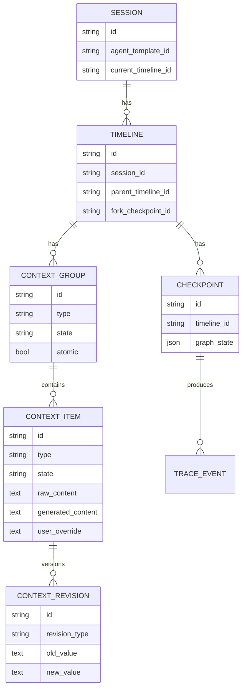
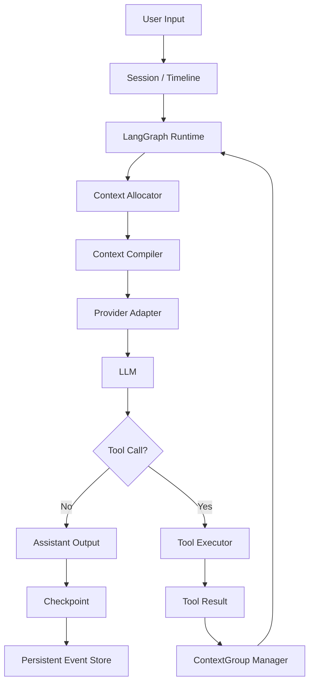
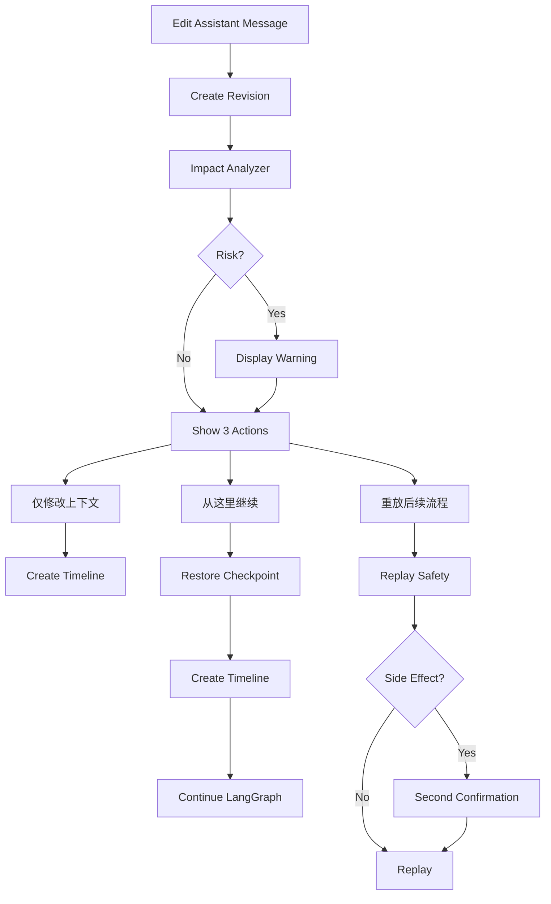
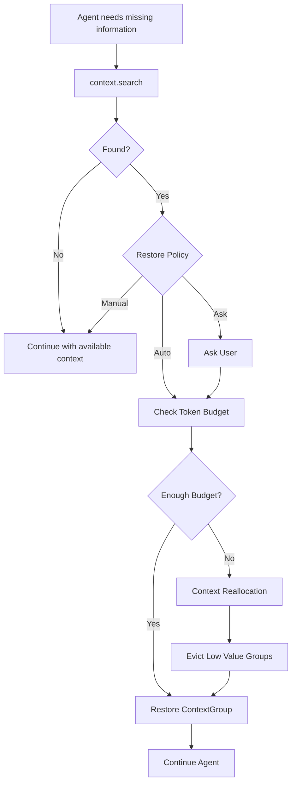

# ContextOS 产品需求与系统设计文档

> 文档类型：Product Requirements + High-Level System Design  
> 产品名称：ContextOS  
> 版本：V1.2 Draft  
> 状态：已确认核心方向，可进入技术方案与实施计划阶段  
> 核心技术栈：LangGraph + Provider Adapter + ContextOS Runtime + ContextOS Studio

---

## 0. 文档目的

本文档用于定义 ContextOS V1 的产品边界、核心功能、交互方式、运行时模型、上下文管理机制、Agent 工作流能力及主要验收标准。

ContextOS 不以“再做一个通用低代码 Agent 平台”为目标，而是优先解决现有 Agent 系统中的几个核心问题：

1. Agent 上下文不可观察。
2. 历史上下文被截断或摘要后通常不可逆。
3. 用户无法安全修改历史 AI 回复并让修改真正影响后续 Agent。
4. ToolCall / ToolResult 等结构化上下文难以安全淘汰。
5. Agent Runtime、对话、Context、Checkpoint、Workflow 之间缺乏统一抽象。
6. 开发者能够调试 Agent，但普通用户无法直观控制 Agent“当前知道什么”。
7. 上下文压缩通常以“删除”为中心，而不是以“Working Set 管理”为中心。

ContextOS V1 将围绕以下五个核心能力展开：

- **Editable Conversation**
- **Reversible Context**
- **ContextGroup**
- **Context Compiler**
- **LangGraph Workflow**

---

# 1. 产品定位

## 1.1 一句话定义

**ContextOS 是一个基于 LangGraph 的可编排 Agent Runtime 与 Studio，使 Agent 的上下文可以被观察、编辑、压缩、移出、恢复和安全重放，同时保证完整历史与模型消息协议的正确性。**

## 1.2 产品分层

### ContextOS Studio

面向普通高级用户与 Agent 开发者，提供：

- AI Chat 工作台
- 历史 Message 编辑
- 上下文可视化
- 上下文手动管理
- Workflow Builder
- Agent Template
- Timeline / Checkpoint 查看
- ToolCall / ToolResult 调试
- State Inspector
- Replay 与风险确认

### ContextOS Runtime

面向 Agent Runtime 与开发者 SDK，提供：

- LangGraph 执行
- Context Virtualization
- ContextGroup
- Context Allocator
- Context Compiler
- Context Restore
- Context Revision
- Timeline / Checkpoint
- Replay Safety
- Provider Adapter
- Tool Side Effect Policy
- Runtime Trace

---


## 1.3 ContextOS 总体产品架构图


> 图示说明：ContextOS 采用 **Studio + Runtime** 两层架构。Studio 面向用户与开发者；Runtime 负责 LangGraph 执行、上下文虚拟化、Checkpoint/Timeline、工具调用、状态管理与模型/提示词能力，下层持久化 Session、Message、事件与 Tool Result 等数据。

# 2. 核心设计原则

## 2.1 Full History != LLM Context

完整历史与当前发送给模型的上下文必须是两个不同概念。

```text
Persistent History
        ↓
Context Virtualization
        ↓
Working Context
        ↓
Context Compiler
        ↓
Provider Messages
        ↓
LLM
```

Persistent History 是事实来源；Working Context 是当前模型真正使用的信息集合。

## 2.2 原始历史不可被静默覆盖

用户修改历史 AI 回复、Summary、Abstract、Working Context 时：

- 原始内容必须保留；
- 必须记录修改来源；
- 必须记录 revision；
- 必须可查看原始版本；
- 必须支持恢复系统版本。

## 2.3 上下文压缩默认可逆

```text
RAW
→ ABSTRACT
→ EVICTED
→ RESTORE
→ RAW
```

淘汰不等于删除。

## 2.4 ContextGroup 优先于 Message

ContextOS 不默认以单条 Message 作为上下文淘汰原子。

ToolCall / ToolResult、Agent Step、Human Approval 等逻辑相关内容必须组成 ContextGroup。

## 2.5 Context Allocator 与 Context Compiler 分离

### Context Allocator

决定：当前应该让模型看到什么。

### Context Compiler

决定：如何把这些内容转换成当前 Provider 可以合法接受的 Message 序列。

两者禁止耦合。

## 2.6 Provider-neutral

ContextOS 内部不能直接使用某个厂商的 Message Schema 作为核心领域模型。

```text
ContextOS IR
    ↓
Provider Adapter
    ↓
OpenAI / Anthropic / Gemini / Compatible API
```

## 2.7 Workflow 可视化但不过度 DSL 化

普通用户使用 Workflow Builder，高级开发者可以挂接：

- CustomNode
- CustomRouter
- CustomReducer
- CustomContextPolicy

不要求把 LangGraph 全部能力映射成可视化节点。

---

# 3. V1 范围

## 3.1 P0：必须实现

### Chat

- Agent 对话
- 流式输出
- ToolCall 展示
- ToolResult 展示
- 当前 Token 使用情况
- 当前 Context 使用情况
- 开发者模式

### Editable Conversation

- 编辑历史 AI Message
- 原始版本保留
- 编辑后影响检查
- 创建轻量 Timeline
- 从修改点继续
- 后续流程重放

### Context Management

- ContextGroup
- RAW / ABSTRACT / REFERENCE / EVICTED / PINNED
- Placeholder
- Pin / Unpin
- Abstract
- Evict
- Restore
- Edit
- View Raw

### Agent Restore

- Agent 自动搜索上下文
- Agent 自动恢复上下文
- Auto / Ask / Manual 策略

### Safety

- ToolCall / ToolResult 配对校验
- Tool 副作用识别
- Replay 二次确认
- Context 编辑影响分析

### Runtime

- LangGraph
- Checkpoint
- Timeline
- Context Allocator
- Context Compiler
- Provider Adapter
- Runtime Trace

### Workflow

- 基础 Workflow Builder
- Agent Template
- Manifest
- Custom Extension

### Debug

- Graph
- State
- Checkpoint
- Trace
- ToolCall
- Context 状态

## 3.2 P1：后续增强

- Semantic Restore
- Partial Restore
- Context 语义搜索
- Context Priority 自动评分
- Branch Compare
- Prompt Diff
- State Diff
- Timeline Compare
- Agent A/B Run
- Context Cost Analysis
- Context Restore Ranking
- 自定义 ContextGroup
- 更多 Provider
- 模板导入导出
- 模板版本管理增强
- Context Snapshot
- Context Replay Sandbox

## 3.3 明确不进入 V1

以下能力仅预留扩展字段或接口，不进入 V1 业务实现：

- 多租户 SaaS
- Workspace 管理后台
- 企业组织架构
- 复杂 RBAC
- 计费系统
- Marketplace
- 插件市场
- Branch Merge
- Cherry-pick
- 多人实时协作
- 完整发布审批流
- 大型 Agent Evaluation 平台
- 真正物理删除历史数据
- Desktop Client（V1 不实现，但架构必须支持后续接入）

---

# 4. 用户角色

## 4.1 普通高级用户

主要使用：

- Chat
- Message 编辑
- Context 面板
- Restore
- Evict
- Pin
- Agent Template

默认不需要理解 LangGraph、Checkpoint、Reducer、Provider Message Schema。

## 4.2 Agent 开发者

主要使用：

- Workflow Builder
- Template
- Graph
- State
- Checkpoint
- Tool
- Prompt
- Context Policy
- Trace
- Replay

## 4.3 Runtime 开发者

主要使用：

- ContextOS Runtime SDK
- Manifest
- Extension API
- CustomNode
- CustomReducer
- CustomContextPolicy
- Provider Adapter

---

# 5. 核心领域模型

## 5.1 Session

代表一次完整的用户 Agent 会话。

```text
Session
├── id
├── workspace_id       # V1 保留字段
├── agent_template_id
├── current_timeline_id
├── created_at
└── status
```

## 5.2 Timeline

Timeline 是轻量级“对话版本”，不实现 Git 式复杂分支。

```text
Timeline
├── id
├── session_id
├── parent_timeline_id
├── fork_checkpoint_id
├── fork_message_id
├── created_at
└── status
```

UI 默认不使用“Git Branch”术语。

普通用户看到：

> 已从这里创建新的对话版本。

开发者模式可以显示：

```text
Timeline #3
Forked from Checkpoint #28
```

## 5.3 Checkpoint

Checkpoint 对应 LangGraph 可恢复执行状态。

```text
Checkpoint
├── id
├── session_id
├── timeline_id
├── graph_state
├── message_cursor
├── context_revision
├── created_at
└── parent_checkpoint_id
```

## 5.4 ContextItem

ContextItem 是 ContextOS 的最小上下文数据单元。

```text
ContextItem
├── id
├── session_id
├── timeline_id
├── group_id
├── type
├── state
├── raw_content
├── generated_content
├── user_override
├── effective_content
├── source_ids[]
├── token_count_raw
├── token_count_effective
├── priority
├── restorable
├── created_at
└── updated_at
```

### type

```text
MESSAGE
TOOL_CALL
TOOL_RESULT
SUMMARY
MEMORY
RESOURCE
SYSTEM
PLACEHOLDER
```

### state

```text
RAW
ABSTRACT
REFERENCE
EVICTED
PINNED
```

## 5.5 ContextGroup

ContextGroup 是上下文操作的默认原子。

```text
ContextGroup
├── id
├── session_id
├── timeline_id
├── type
├── item_ids[]
├── atomic
├── state
├── summary
├── placeholder
├── source_token_count
├── effective_token_count
├── restorable
├── dependencies[]
├── created_at
└── updated_at
```

### group_type

V1 至少支持：

```text
MESSAGE_GROUP
TOOL_INTERACTION
AGENT_STEP
SUBTASK
RESOURCE_INTERACTION
HUMAN_APPROVAL
CUSTOM_GROUP
```

V1 不允许用户自由拆分/合并 ContextGroup。

---

# 6. ContextGroup 自动分组规则

## 6.1 Tool Interaction

以下内容自动组成一个 ContextGroup：

```text
Assistant ToolCall
ToolResult
Related Assistant continuation
```

如果一次 Assistant Message 发起多个 ToolCall：

```text
Assistant
├── ToolCall A
└── ToolCall B

ToolResult A
ToolResult B
```

必须作为同一个 Tool Interaction Group 或一个父 Group 下的完整子 Group 管理。

禁止只淘汰 ToolCall 或只淘汰 ToolResult。

## 6.2 Agent Step

LangGraph Node 执行期间生成的：

- Model Call
- ToolCall
- ToolResult
- State Update
- Assistant Message

可以组成 AGENT_STEP。

## 6.3 Human Approval

```text
Agent Approval Request
User Approval / Reject
Related Execution
```

必须保持逻辑完整。

---

# 7. Context 状态

## 7.1 RAW

原始内容直接进入 Working Context。

## 7.2 ABSTRACT

原始内容不进入 Working Context，使用系统生成的 abstraction。

## 7.3 REFERENCE

只保留结构化引用或 Placeholder。

## 7.4 EVICTED

内容不进入 LLM Working Context，原始内容仍存储于 Persistent History。

## 7.5 PINNED

强制保留。

典型内容：

- System Instruction
- 用户明确约束
- 当前任务目标
- 关键业务条件
- 用户手动 Pin 的 Context

---

# 8. Placeholder

Placeholder 必须是一级领域对象，而不是简单字符串。

示例：

```xml
<context-placeholder
  id="ctx_group_21"
  type="tool_interaction"
  source-count="4"
  restorable="true">
此前完成了数据库结构检查。
详细 ToolCall 与 Tool Result 已从当前上下文移出。
必要时可以恢复。
</context-placeholder>
```

必须记录：

```text
id
group_id
type
summary
source_count
original_tokens
current_tokens
restorable
reason
```

---

# 9. Chat 工作台

## 9.1 页面结构

建议：

```text
┌─────────────────────────────────────────────────────────┐
│ ContextOS | Agent Template | Session | Developer Mode   │
├────────────┬────────────────────────────┬───────────────┤
│ Sessions   │ Chat                       │ Context       │
│ Templates  │                            │ Panel         │
│ Timelines  │                            │               │
├────────────┴────────────────────────────┴───────────────┤
│ Composer                                                │
└─────────────────────────────────────────────────────────┘
```

## 9.2 Chat Message

每条 Message 需要支持：

- role
- timestamp
- status
- token count
- context state
- group id
- tool relation
- edit action
- raw view

开发者模式额外显示：

- message_id
- checkpoint_id
- context_group_id
- trace_id

---


## 9.3 Chat 工作台参考界面


> 参考重点：左侧为会话、Agent 模板与最近 Timeline；中间为可直接编辑的 AI 对话；右侧展示 Active / Abstract / Evicted Context、Timeline 与影响分析。历史 AI 回复编辑后提供“仅修改上下文 / 从这里继续 / 重放后续流程”三种行为。

# 10. 编辑历史 AI Message

用户可以直接编辑 AI 历史回复。

编辑完成后提供三种操作。

## 10.1 仅修改上下文

行为：

1. 保存原始 Message。
2. 创建 Message Revision。
3. 创建新的轻量 Timeline。
4. edited message 成为当前有效版本。
5. 后续旧消息默认不自动进入新的 Working Context。
6. 不自动重新执行 Agent。

## 10.2 从这里继续

行为：

1. 基于编辑点最近 Checkpoint 创建 Timeline。
2. 应用新的 Message Revision。
3. 从修改后的状态继续 LangGraph。
4. 不自动重放旧 Timeline 的后续执行。

## 10.3 重放后续流程

行为：

1. 执行 Impact Analyzer。
2. 分析 ToolCall。
3. 分析副作用。
4. 展示风险。
5. 用户确认。
6. 根据 Tool Replay Policy 执行。

---

# 11. Edit Impact Analyzer

每次历史编辑后都执行影响分析。

## 11.1 检查类型

### Message / ToolResult 语义冲突

例如：

```text
ToolResult:
status = shipped
```

用户修改 AI 回复为：

```text
订单已经退款。
```

必须提示：

> 修改后的内容与历史 Tool Result 存在潜在冲突。

### ToolCall 参数影响

用户修改内容可能意味着旧 ToolCall 参数不再成立。

### State Dependency

检查后续 State Update 是否依赖被编辑的数据。

### Graph Dependency

检查后续节点是否依赖该 Message / State。

### Side Effect

识别：

- send_email
- update_database
- create_order
- charge_payment
- delete_resource
- publish_content
- external POST
- 自定义标记为 side_effect=true 的 Tool

---

# 12. Replay Safety

## 12.1 Tool Metadata

每个 Tool 必须定义：

```text
tool_id
name
side_effect
idempotent
replay_policy
risk_level
```

### side_effect

```text
NONE
READ
WRITE
EXTERNAL_WRITE
DESTRUCTIVE
FINANCIAL
```

## 12.2 Replay 选项

当存在 ToolCall 时：

```text
使用历史 Tool Result
重新调用 Tool
跳过 Tool
取消
```

## 12.3 二次确认

以下情况必须二次确认：

```text
WRITE
EXTERNAL_WRITE
DESTRUCTIVE
FINANCIAL
```

V1 默认推荐：

```text
READ → 可自动重放
WRITE → Ask
EXTERNAL_WRITE → Ask
DESTRUCTIVE → Ask
FINANCIAL → Ask
```

---

# 13. Context 编辑

用户允许直接编辑：

- Summary
- Abstract
- Working Context
- Memory

数据模型必须保留：

```text
raw_content
generated_content
user_override
```

最终有效内容：

```text
effective_content =
    user_override
    ?? generated_content
    ?? raw_content
```

## 13.1 UI 标识

被人工修改的上下文必须显示：

```text
User Modified
```

并允许：

- 查看系统版本
- 查看原始来源
- 恢复系统版本
- 重新生成摘要
- Pin
- Evict

---

# 14. Context Restore

## 14.1 Agent 主动 Restore

Agent 内部提供：

```text
context.search(...)
context.restore(...)
```

示例：

```text
用户：
之前讨论的 Kingbase SQL 改写有哪些？

Agent
 ↓
当前 Abstract 不足
 ↓
context.search("Kingbase SQL")
 ↓
context.restore(group_183)
 ↓
获取原始信息
 ↓
回答
```

## 14.2 Restore 策略

```text
AUTO
ASK
MANUAL
```

模板配置示例：

```yaml
context:
  restore:
    mode: auto
    max_tokens_per_restore: 12000
    max_restore_per_turn: 3
```

## 14.3 Restore 超预算

如果：

```text
Current Working Context = 110K
Model Limit = 128K
Restore Group = 30K
```

不能直接 Restore。

必须：

```text
Restore Request
      ↓
Context Allocator
      ↓
计算缺口
      ↓
淘汰其他低价值 ContextGroup
      ↓
Restore
```

Restore 本质上是一次 Context Reallocation。

---

# 15. Context Allocator

## 15.1 职责

Context Allocator 决定：

- Pin 哪些内容
- RAW 哪些内容
- Abstract 哪些内容
- Evict 哪些内容
- Restore 哪些内容

## 15.2 V1 策略

V1 先采用简单、可解释策略。

### 永远优先保留

- System
- 当前 User Message
- 当前执行 Node 所需输入
- PINNED
- 最近若干轮对话

### 优先压缩

- 大 Tool Result
- 搜索结果
- RAG 原文
- 日志
- 文件全文
- 已完成子任务

### 优先淘汰

- 很旧且低相关内容
- 已被 Summary 完整覆盖的内容
- 重复内容

## 15.3 Trigger

避免每轮持续抖动。

建议：

```text
Context > 80%
    ↓
触发压缩
    ↓
压缩到 60%~65%
```

配置项：

```text
high_watermark
target_watermark
```

---

# 16. Context Compiler

Context Compiler 是 V1 最重要的 Runtime 组件之一。

## 16.1 输入

```text
ContextOS Working Context
```

## 16.2 输出

```text
Provider-specific message/input payload
```

## 16.3 编译流程

```text
Context Groups
      ↓
Group Integrity Validation
      ↓
Context State Resolution
      ↓
Placeholder Rendering
      ↓
Tool Dependency Validation
      ↓
Provider Constraint Validation
      ↓
Token Validation
      ↓
Provider Adapter
```

## 16.4 必须校验

### ToolCall / ToolResult

必须成对合法。

### Message Role

保证 role 顺序满足 Provider 要求。

### Tool ID

ToolResult 必须找到对应 ToolCall。

### 多 ToolCall

必须保证多 ToolCall 的 ToolResult 映射完整。

### Placeholder

Placeholder 必须作为合法文本/结构映射。

### Token Budget

最终编译结果不得超过模型限制。

---

# 17. Provider Adapter

## 17.1 内部 IR

ContextOS 自定义：

```text
SystemInstruction
UserMessage
AssistantMessage
ToolCall
ToolResult
ContextPlaceholder
ContextReference
```

## 17.2 Adapter

```text
ProviderAdapter
├── compile_message()
├── compile_tool_call()
├── compile_tool_result()
├── compile_placeholder()
├── validate_sequence()
├── count_tokens()
└── capability()
```

## 17.3 V1

优先完整实现：

```text
OpenAI-compatible Adapter
```

架构预留：

```text
OpenAI
Anthropic
Gemini
Azure OpenAI
Local Model
```

---

# 18. LangGraph Runtime

## 18.1 ContextOS 不重新实现

以下直接利用 LangGraph：

- StateGraph
- Node
- Edge
- Command
- Checkpoint
- Interrupt
- SubGraph
- Reducer
- ToolNode

## 18.2 ContextOS 扩展

ContextOS 自己提供：

```text
ContextVirtualizer
ContextGroupManager
ContextAllocator
ContextCompiler
TimelineManager
MessageRevisionManager
ImpactAnalyzer
ReplayManager
ProviderAdapter
TraceCollector
```

---

# 19. Agent Template

## 19.1 Manifest

模板采用声明式 Manifest。

示例：

```yaml
template:
  id: research-agent
  name: Research Agent
  version: 1.0.0

graph:
  state_schema: default_chat_state

  nodes:
    - id: planner
      type: agent
      config:
        prompt: prompts/planner
        model: default
        tools:
          - web_search

    - id: review
      type: custom
      extension: extensions.requirement_review

  edges:
    - from: START
      to: planner
    - from: planner
      to: review
    - from: review
      to: END

context:
  policy: balanced
  budget:
    high_watermark: 0.8
    target_watermark: 0.65
  restore:
    mode: auto
    max_tokens_per_restore: 12000
    max_restore_per_turn: 3

checkpoint:
  enabled: true

ui:
  editable_messages: true
  expose_context_panel: true
```

## 19.2 Runtime Pipeline

```text
Manifest
   ↓
Manifest Parser
   ↓
Validator
   ↓
Extension Resolver
   ↓
LangGraph Compiler
   ↓
Compiled Graph
   ↓
ContextOS Runtime
```

---

# 20. Workflow Builder

## 20.1 V1 节点

控制在以下范围：

```text
Agent
LLM
Prompt
Tool
Condition
Router
SubGraph
HumanApproval
ContextOperator
Memory
Output
CustomNode
```

## 20.2 Custom Extension

高级开发者支持：

```text
CustomNode
CustomRouter
CustomReducer
CustomContextPolicy
```

## 20.3 节点配置

至少包括：

```text
Node Name
Description
Prompt
Model
Tool Bindings
Context Policy
Retry Policy
Checkpoint
UI Exposure
```

---


## 20.4 Workflow Builder 参考界面


> 参考重点：V1 通过少量稳定节点完成可视化 LangGraph 编排，并通过 **Manifest + Custom Extension** 承接复杂 Python 逻辑；Context Policy、Checkpoint、Tool Binding 等作为节点或模板配置，而不是不断扩张 DSL。

# 21. Context Operator Node

Workflow Builder 中增加 ContextOS 特有节点：

```text
ContextOperator
```

操作：

```text
PIN
UNPIN
ABSTRACT
EVICT
RESTORE
SEARCH
SUMMARIZE
```

示例：

```text
Planner
  ↓
Search
  ↓
ContextOperator(Abstract Search Results)
  ↓
Writer
```

---

# 22. Studio 页面

V1 只做四个核心页面。

## 22.1 Chat

主要功能：

- 对话
- 编辑
- Context 面板
- Timeline
- Impact Analyzer
- Replay

## 22.2 Workflow

主要功能：

- Node Library
- Canvas
- Edge
- Node Config
- Graph Validation
- Save
- Preview
- Publish

## 22.3 Template

主要功能：

- Template Manifest
- Model
- Prompt
- Tools
- Context Policy
- Workflow
- UI Config

## 22.4 Debug

主要功能：

```text
Graph
Timeline
Checkpoint
Message
State
Execution Trace
ToolCall
ToolResult
Context
Prompt
Inputs
```

---

# 23. Debug View

建议布局：

```text
┌───────────────┬──────────────────────┬────────────────────┐
│ Timeline      │ Current Conversation │ State Inspector    │
│ Graph         │                      │                    │
├───────────────┼──────────────────────┼────────────────────┤
│               │ Execution Trace      │ Tool Calls         │
│               │                      │ Context State      │
│               │                      │ Prompt / Inputs    │
└───────────────┴──────────────────────┴────────────────────┘
```

---


## 23.1 开发者模式 / 调试视图参考界面


> 参考重点：开发者模式同时展示 Timeline / Checkpoint、当前对话、Execution Trace、State Inspector、ToolCall、Context 状态和 Prompt/Input。重放涉及副作用 Tool 时必须展示风险并要求二次确认。

# 24. Execution Trace

必须记录：

```text
Model Call
Tool Call
Tool Result
State Update
Context Edit
Context Evict
Context Restore
Checkpoint
Replay
User Override
```

Trace 数据至少：

```text
trace_id
session_id
timeline_id
checkpoint_id
step_type
component
input_summary
output_summary
duration
status
timestamp
```

---

# 25. 上下文 UI

Context Panel 示例：

```text
上下文 42.6K / 128K

📌 PINNED
系统约束                     1.2K
项目需求                     4.5K

● RAW
最近对话                    12.4K
数据分析结果                 8.7K

◐ ABSTRACT
前期方案讨论                 3.1K
技术选型讨论                 2.3K

○ EVICTED
历史搜索结果                26.4K
旧调试日志                  18.9K
```

---

# 26. 删除 / 隐藏

## 26.1 移出上下文

```text
RAW
 ↓
EVICTED
```

原始数据保留。

## 26.2 隐藏对话

```text
VISIBLE
 ↓
HIDDEN
```

不再默认显示，但 History 保留。

## 26.3 PURGED

V1 不提供真正物理删除。

数据层预留：

```text
PURGED
```

---

# 27. Context Revision

所有上下文修改必须生成 Revision。

```text
ContextRevision
├── id
├── context_item_id
├── revision_type
├── old_value
├── new_value
├── operator
├── created_at
└── reason
```

revision_type：

```text
USER_EDIT
SYSTEM_ABSTRACT
SYSTEM_EVICT
USER_RESTORE
AGENT_RESTORE
USER_PIN
USER_UNPIN
```

---

# 28. 数据关系



---

# 29. 核心运行流程



---

# 30. Message 编辑流程



---

# 31. Context Restore 流程



---

# 32. API 设计建议

V1 API 可按 REST + SSE/WebSocket 设计。

## 32.1 Session

```text
POST   /api/sessions
GET    /api/sessions/{id}
POST   /api/sessions/{id}/messages
GET    /api/sessions/{id}/messages
```

## 32.2 Message

```text
PATCH  /api/messages/{id}
POST   /api/messages/{id}/continue
POST   /api/messages/{id}/replay
GET    /api/messages/{id}/impact
```

## 32.3 Timeline

```text
GET    /api/sessions/{id}/timelines
GET    /api/timelines/{id}
POST   /api/timelines/{id}/activate
```

## 32.4 Context

```text
GET    /api/sessions/{id}/context

POST   /api/context-groups/{id}/pin
POST   /api/context-groups/{id}/unpin

POST   /api/context-groups/{id}/abstract
POST   /api/context-groups/{id}/evict
POST   /api/context-groups/{id}/restore

PATCH  /api/context-items/{id}
GET    /api/context-items/{id}/raw
GET    /api/context-items/{id}/revisions
```

## 32.5 Workflow

```text
POST   /api/templates
GET    /api/templates/{id}
PUT    /api/templates/{id}

POST   /api/templates/{id}/validate
POST   /api/templates/{id}/compile
POST   /api/templates/{id}/run
```

## 32.6 Debug

```text
GET /api/sessions/{id}/trace
GET /api/checkpoints/{id}
GET /api/checkpoints/{id}/state
GET /api/messages/{id}/trace
```

---

# 33. Runtime 模块边界

建议服务内部分为：

```text
contextos/
├── runtime/
│   ├── graph/
│   ├── session/
│   ├── timeline/
│   ├── checkpoint/
│   └── trace/
│
├── context/
│   ├── group/
│   ├── allocator/
│   ├── compiler/
│   ├── restore/
│   ├── revision/
│   └── policy/
│
├── provider/
│   ├── base/
│   └── openai_compatible/
│
├── tool/
│   ├── executor/
│   ├── registry/
│   ├── risk/
│   └── replay/
│
├── template/
│   ├── manifest/
│   ├── validator/
│   ├── compiler/
│   └── extension/
│
└── api/
```

---

# 34. 前端模块建议

```text
src/
├── pages/
│   ├── Chat/
│   ├── Workflow/
│   ├── Template/
│   └── Debug/
│
├── features/
│   ├── conversation/
│   ├── context-panel/
│   ├── message-editor/
│   ├── impact-analyzer/
│   ├── replay/
│   ├── timeline/
│   ├── workflow-builder/
│   └── trace/
│
└── shared/
```

---

# 35. 非功能需求

## 35.1 可恢复性

任何：

```text
Abstract
Evict
User Edit
Agent Restore
```

都不能导致原始历史不可恢复。

## 35.2 一致性

任何发送给 Provider 的上下文必须通过：

```text
Context Compiler Validation
```

禁止把未经 Compiler 的内部 Message 直接发送给 Provider。

## 35.3 性能

建议目标：

- Context 面板加载 < 500ms
- Message 编辑提交 < 300ms
- Context 编译额外开销 P95 < 100ms（不含模型调用）
- Timeline 创建 < 200ms
- ContextGroup 操作 < 300ms

大规模历史需要分页/懒加载。

## 35.4 Trace

所有 Agent 执行必须有 Trace ID。

## 35.5 幂等

Replay、Restore、Checkpoint 等 API 应支持 request_id 或 idempotency_key。

## 35.6 客户端与前后端架构约束

ContextOS V1 必须采用**前后端分离**架构，并遵循 **Web First、Multi-client Ready** 原则。

### 35.6.1 Web 为第一客户端，但不是唯一客户端

V1 优先实现 Web Client。后端 Runtime 不得依赖浏览器环境、Web 前端状态或特定前端框架。

后续应允许在不重写核心 Runtime 的前提下扩展：

- Desktop Client
- CLI
- VS Code / JetBrains 等 IDE 插件
- 其他自动化客户端

Desktop Client 建议优先复用 Web 前端能力，可采用 Tauri 等桌面容器；该能力不进入 V1 实现范围。

### 35.6.2 后端是 Agent 状态的唯一事实来源

以下核心状态与业务规则必须由后端持有并执行：

- Session
- Timeline
- Checkpoint
- Message Revision
- ContextItem / ContextGroup
- Context State
- Context Revision
- LangGraph State
- ToolCall / ToolResult
- Replay Policy
- Impact Analysis
- Provider 编译结果

前端只负责：

- UI 临时状态
- 用户交互状态
- Runtime 状态投影与展示

例如前端可以维护：

```text
selectedMessageId
selectedContextGroupId
currentPanel
graphViewport
```

但不得把 Timeline、Checkpoint、Context State 等核心运行状态仅保存在浏览器本地。

### 35.6.3 所有核心操作必须通过 Runtime API

例如用户执行 ContextGroup Evict 时，前端不得直接修改本地 messages 数组。

正确流程必须为：

```text
Web / Desktop
      ↓
ContextOS API
      ↓
ContextGroupManager
      ↓
ContextAllocator
      ↓
ContextCompiler
      ↓
Persistent State
```

因此 Web 与未来 Desktop Client 应共享同一套核心 API 语义。

### 35.6.4 通信协议

V1 建议：

```text
普通 CRUD / 状态操作
→ REST

LLM 流式输出
→ SSE

需要双向实时控制的调试、Interrupt 等场景
→ WebSocket（按需引入）
```

不得为了统一技术栈而将所有接口强制实现为 WebSocket。

### 35.6.5 客户端断线恢复

Web 页面刷新、浏览器重连或客户端重新启动后，必须能够从后端恢复：

- 当前 Session
- 当前 Timeline
- Checkpoint
- Message / Revision
- ContextGroup 状态
- 当前 Context 使用情况
- 必要的 Runtime Trace

客户端本地缓存只能用于体验优化，不能作为 Agent Runtime 的唯一状态来源。

### 35.6.6 推荐客户端演进路线

```text
V1
Web Client
   ↓
ContextOS Backend + LangGraph Runtime

P1/P2
Web Client ─────┐
Desktop Client ─┼──→ 同一 ContextOS Runtime API
CLI / IDE ──────┘
```

如果后期实现 Desktop Local Runtime，也应复用同一套领域模型、Context Compiler 与 Provider Adapter，不另行维护一套不兼容的 Agent 实现。

---

# 36. 安全要求

## 36.1 Prompt Injection

恢复历史 Context 时，必须标注来源与信任级别。

后续可以扩展：

```text
trust_level
source_type
external_content
```

## 36.2 Tool

Tool 必须声明副作用等级。

没有声明的自定义 Tool 默认：

```text
side_effect = WRITE
```

宁可更保守。

## 36.3 Replay

不能默认自动重放未知副作用 Tool。

---

# 37. V1 优先级拆分

## P0-1 Runtime 基础

- Session
- Timeline
- Checkpoint
- LangGraph Runtime
- Trace

## P0-2 Context Core

- ContextItem
- ContextGroup
- RAW / ABSTRACT / EVICTED / PINNED
- Placeholder
- Context Revision

## P0-3 Context Compiler

- ContextOS IR
- ToolCall / ToolResult 验证
- Provider Adapter
- Token Budget

## P0-4 Chat

- Chat UI
- Stream
- ToolCall
- ToolResult
- Context Panel

## P0-5 Editable Message

- Edit
- Revision
- Timeline Fork
- 3 Actions

## P0-6 Safety

- Impact Analyzer
- Tool Risk
- Replay Confirmation

## P0-7 Restore

- context.search
- context.restore
- Auto / Ask / Manual
- Context Reallocation

## P0-8 Workflow

- Manifest
- LangGraph Compiler
- Basic Builder
- Template

## P0-9 Debug

- Trace
- State
- Timeline
- Checkpoint
- Context
- Tool

---

# 38. MVP 验收场景

## 场景 1：正常 Agent 对话

用户可以：

1. 创建 Agent Session。
2. 正常对话。
3. Agent 调用 Tool。
4. ToolResult 正常返回。
5. Chat 页面显示 ToolCall 与结果。
6. Checkpoint 正常生成。

## 场景 2：淘汰 Tool Interaction

已存在：

```text
Assistant ToolCall
ToolResult
Assistant Result
```

用户点击“移出上下文”。

系统必须：

1. 将整个 ContextGroup Evict。
2. 不得只删除 ToolCall。
3. 不得只删除 ToolResult。
4. 生成 Placeholder。
5. Context Compiler 输出合法。
6. 下一轮模型调用成功。

## 场景 3：恢复淘汰内容

用户后续询问被淘汰上下文中的细节。

Agent：

1. 搜索 Context。
2. 找到 Evicted Group。
3. Restore。
4. 如预算不足自动 Reallocate。
5. 完成回答。

## 场景 4：编辑历史回复

用户修改历史 AI Reply。

系统：

1. 保存原始版本。
2. 生成 Revision。
3. Impact Analyzer 执行。
4. 展示三种行为。
5. 创建新 Timeline。
6. 原 Timeline 仍可查看。

## 场景 5：ToolResult 冲突

历史：

```text
ToolResult = shipped
```

用户修改：

```text
订单已退款
```

系统必须提示可能与历史 ToolResult 不一致。

## 场景 6：副作用 Replay

历史存在：

```text
send_email
```

用户重放。

系统必须：

1. 检测 Side Effect。
2. 弹出二次确认。
3. 允许选择历史结果 / 重新调用 / 跳过 / 取消。
4. 未确认不得重新调用。

## 场景 7：编辑 Abstract

系统 Summary：

```text
用户最终选择 PostgreSQL。
```

用户改成：

```text
用户最终选择 MySQL。
```

系统：

1. 保存 generated_content。
2. 保存 user_override。
3. Working Context 使用 user_override。
4. Debug 页面可以查看原始版本。
5. 用户可以恢复系统版本。

---

# 39. V1 成功标准

ContextOS V1 成功的关键不是节点数量，也不是支持多少 Provider。

必须验证以下核心价值：

### 1. 用户可以看到 Agent 当前真正“记住”了什么。

### 2. 用户可以主动 Pin / Abstract / Evict / Restore。

### 3. Context 被淘汰后可以恢复，而不是永久丢失。

### 4. 用户可以修改历史 AI 回复，且修改真正影响后续 Agent。

### 5. 修改历史不会静默破坏 ToolCall / ToolResult 结构。

### 6. Agent 可以主动找回之前被移出的上下文。

### 7. 开发者可以从 Graph / State / Checkpoint / Trace / Context 五个维度理解 Agent 为什么这样执行。

### 8. Web 客户端刷新或重新连接后，可以完全从后端恢复 Session、Timeline、Checkpoint、Message Revision 和 Context 状态。

该能力用于证明前端不是 Agent Runtime 的事实来源，并验证未来 Desktop / CLI / IDE 客户端可以复用同一套后端。

如果以上八点成立，ContextOS 的核心产品假设即得到验证。

---

# 40. V1 产品差异化

ContextOS 不以以下能力作为主要差异点：

- Prompt 编辑
- Tool 编排
- 普通 Workflow Builder
- Agent Template

这些是基础能力。

ContextOS 的真正差异化应集中在：

```text
Editable Conversation
+
Reversible Context
+
ContextGroup
+
Agent-driven Restore
+
Safe Replay
+
Observable Context Runtime
```

---

# 41. 后续扩展方向

V1 架构需要预留但不实现：

```text
Workspace
Tenant
RBAC
Billing

Semantic Context Paging
Vector Context Search
Cross-session Memory
Cross-session Context Restore

Distributed Agent Runtime
Multi-Agent Shared Context

Context Merge
Timeline Compare
Context Diff

Provider-specific Cache Optimization

Context Evaluation
Context Quality Scoring
Automatic Context Importance Learning
```

---

# 42. 客户端与后端总体架构

ContextOS 采用前后端分离、多客户端共享 Runtime 的总体结构：

```text
                    ContextOS Clients
        ┌──────────────┬──────────────┐
        │              │              │
      Web           Desktop        Future
   React/Vue        Tauri          CLI / IDE
        │              │              │
        └──────────────┼──────────────┘
                       │
                REST / SSE / WS
                       │
        ┌──────────────▼──────────────┐
        │       ContextOS API         │
        ├─────────────────────────────┤
        │ Application Services        │
        ├─────────────────────────────┤
        │ LangGraph Runtime           │
        │ Context Runtime             │
        │ Workflow Runtime            │
        │ Tool Runtime                │
        │ Replay Safety               │
        │ Provider Adapter            │
        ├─────────────────────────────┤
        │ Persistence                 │
        │ Event / Trace / Checkpoint  │
        └─────────────────────────────┘
```

核心约束：

> **Web 是第一客户端，但不是唯一客户端；ContextOS Runtime 从第一天起不得依赖浏览器。**

---

# 43. 最终系统边界

```text
┌───────────────────────────────────────────────┐
│              ContextOS Studio                │
│                                               │
│ Chat | Context | Workflow | Template | Debug │
└───────────────────────┬───────────────────────┘
                        │
                        ▼
┌───────────────────────────────────────────────┐
│              ContextOS Runtime               │
│                                               │
│ LangGraph Runtime                            │
│ Timeline / Checkpoint                        │
│ ContextGroup                                 │
│ Context Allocator                            │
│ Context Compiler                             │
│ Context Restore                              │
│ Replay Safety                                │
│ Provider Adapter                             │
│ Trace                                        │
└───────────────────────┬───────────────────────┘
                        │
                        ▼
┌───────────────────────────────────────────────┐
│          Persistent History / Storage        │
│                                               │
│ Session                                      │
│ Timeline                                     │
│ Message                                      │
│ Context                                      │
│ Revision                                     │
│ Tool Result                                  │
│ Trace                                        │
└───────────────────────────────────────────────┘
```

---

# 44. 最终结论

ContextOS V1 应优先做成：

> **Context-first Agent Studio**

而不是：

> 大而全的 Agent Platform。

第一阶段最值得投入的核心链路是：

```text
LangGraph Agent
      ↓
Persistent History
      ↓
ContextGroup
      ↓
Context Virtualization
      ↓
Context Allocator
      ↓
Context Compiler
      ↓
Provider
```

以及：

```text
AI Historical Message
      ↓
User Edit
      ↓
Impact Analyzer
      ↓
Timeline
      ↓
Safe Continue / Replay
```

只要这两条链路做好，ContextOS 就已经拥有明确区别于普通 Agent Builder 的技术与产品价值。

---

# 45. 下一阶段建议

需求确认后，下一步应单独生成：

```text
ContextOS-Technical-Design.md
```

重点拆解：

1. Runtime 包结构。
2. LangGraph 集成方式。
3. ContextOS IR。
4. Context Compiler。
5. ContextGroup 分组算法。
6. Timeline / Checkpoint。
7. Message Revision。
8. Impact Analyzer。
9. Replay Manager。
10. Provider Adapter。
11. 数据库表设计。
12. REST / SSE API。
13. 前端状态模型。
14. P0 开发任务拆分。
15. TDD / 集成测试策略。

避免在需求阶段继续引入非核心功能。
