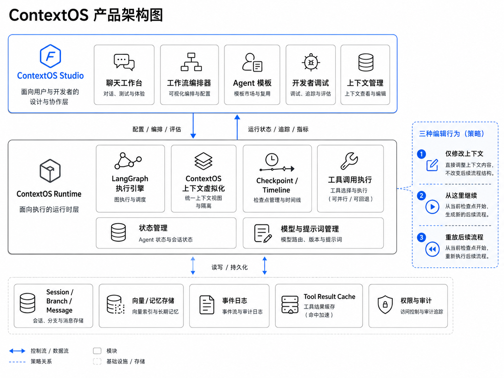
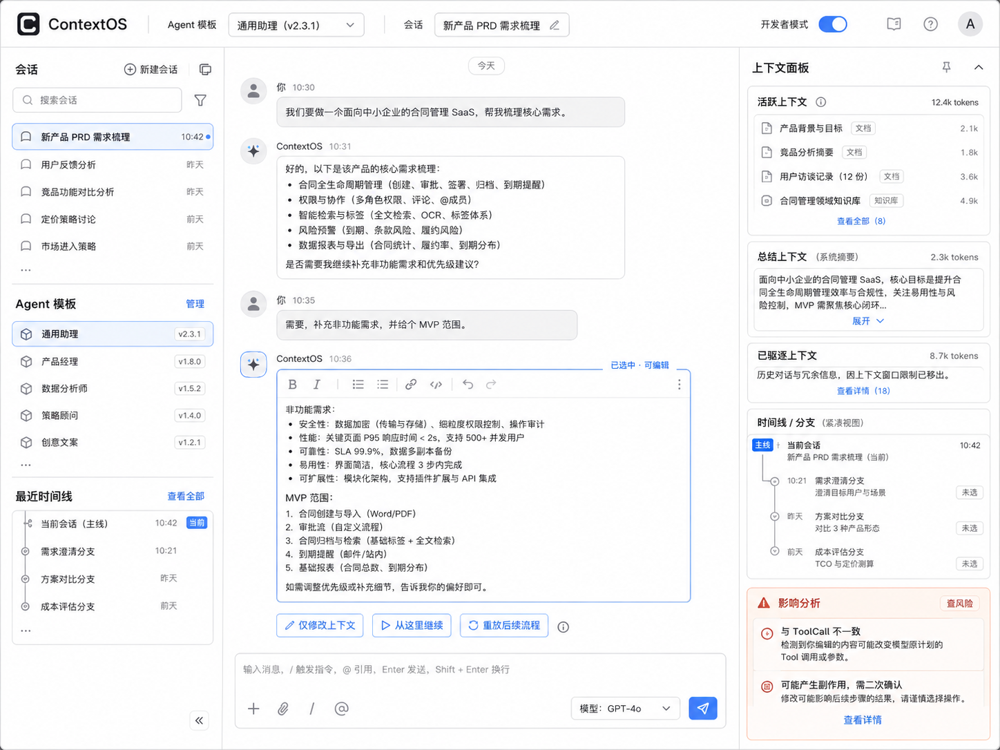
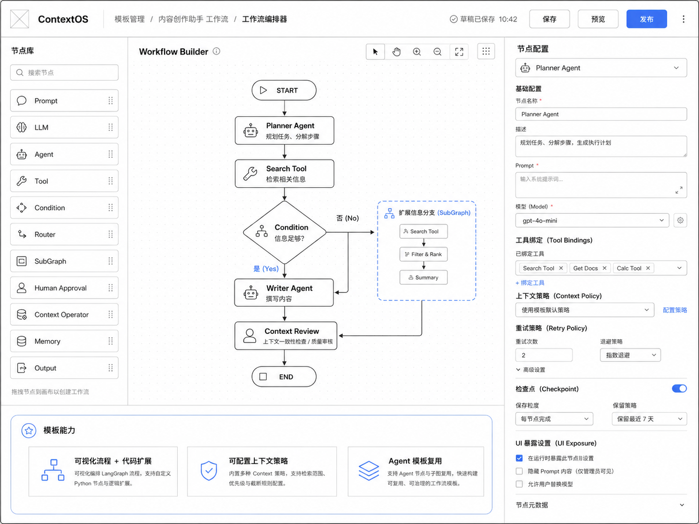
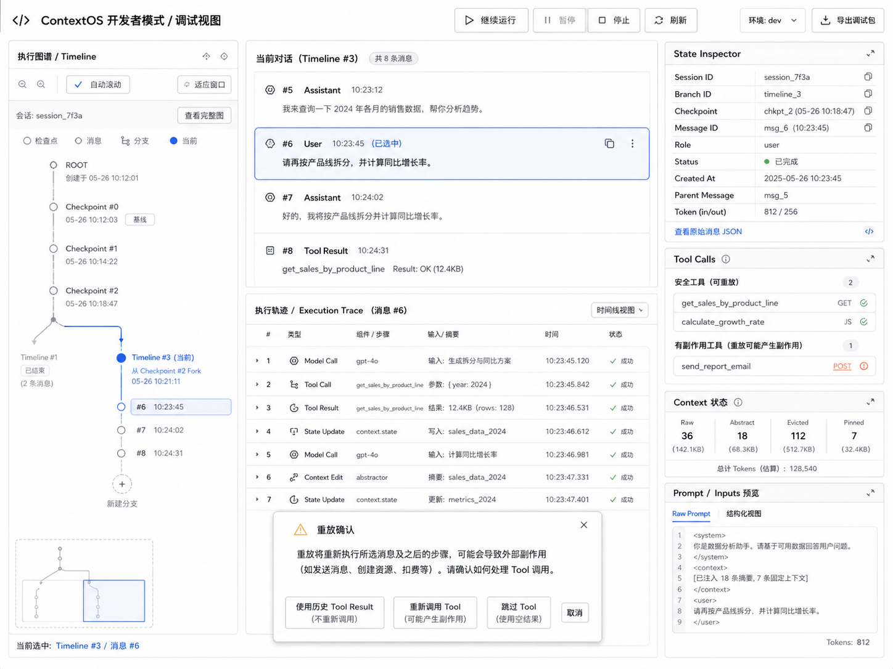

# ContextOS V1 Studio / Web Client Supplement Implementation Plan

> **定位：** 本文是 `ContextOS-V1-Implementation-Task-Plan.md` 的**补充计划**，只补足“完整可运行的页面程序、产品级交互、Web 工程闭环、后续 Desktop/CLI 客户端复用边界”。
>
> **不重复原则：** 已在原计划中出现的 Runtime、Context Core、Compiler、Provider、Replay、Restore、基础 Chat/Context/Workflow/Debug 功能任务，不在本文重新实现；本文把它们作为依赖，并补上原计划没有细化到的页面结构、设计系统、交互状态、客户端数据层、可访问性、视觉回归、联调与可部署运行闭环。
>
> **视觉基线：** 本文随附 `images/` 下 4 张 ContextOS 原型图，并在对应模块中直接引用。实现应以这些图片作为信息架构与关键交互基线，而不是只实现“能打开的占位页面”。
>
> **Open-Source First：** 对成熟、非差异化的通用能力优先评估并复用开源组件，通过 ContextOS Adapter/Wrapper 隔离第三方 API；ContextGroup、Editable Conversation 三行为、Impact Analyzer、Replay Safety、Context Restore 等核心差异化能力保持自研。
>
> **For agentic workers:** 实施时优先使用 `superpowers:subagent-driven-development` 或 `superpowers:executing-plans`。每个任务必须独立测试、独立评审，禁止跨任务顺手实现后续能力。

**Goal:** 在不重复原计划后端/基础 UI 任务的前提下，把 ContextOS Studio 补齐为一个可以真实启动、真实联调、刷新可恢复、具备完整 Chat / Workflow / Template / Debug 工作流的 Web 应用，并让核心客户端代码可在未来 Desktop Client（建议 Tauri）中复用。

**Architecture:** Web First。Studio 采用“页面壳层 + Feature + Client Data Layer + Platform Adapter”的分层；Runtime 后端仍是 Session/Timeline/Checkpoint/Context/Replay 等事实状态唯一来源。Web 只保留选择态、面板布局、未提交表单等 UI 临时状态。Desktop 后续复用同一 API Client、Domain Projection、Event Contract 和大部分 React UI，不复制 Runtime。

**总体产品架构参考：**



**Recommended Frontend Stack（若仓库尚未锁定同类方案）：** React + TypeScript + Vite；React Router；TanStack Query；React Hook Form + Zod；React Flow / XYFlow（Workflow）；shadcn/ui（基础组件）；react-resizable-panels（多栏布局）；assistant-ui（Chat primitives，可选）；Monaco Editor（Prompt/JSON Debug，可选）；Vitest + Testing Library；MSW；Playwright。若真实仓库已有等价技术栈，沿用现状，不为匹配本文做无意义迁移。

---

# 0. 为什么需要这份补充计划

原计划**包含页面任务**，但主要停留在功能骨架和单组件验收层，例如：

- `M00-T03`：四个 Studio 路由骨架；
- `M04-T03 ~ M04-T06`：ChatPage、ToolInteractionCard、Context Panel、Developer Mode；
- `M05-T05 / M06-T06`：Message Editor、Impact/Replay UI；
- `M08-T06 / M08-T07`：基础 Workflow Canvas、Template 页面；
- `M09-T02 / M09-T03`：Debug Graph/Timeline/State/Trace UI。

这些任务足以保证“有页面、有核心组件”，但不足以单独保证以下目标：

1. 页面结构与附件原型一致，具备完整导航、三栏/多栏布局、可伸缩面板和跨面板联动；
2. 前端拥有稳定的数据访问层，而不是每个组件自行 `fetch`；
3. SSE 断线、刷新恢复、错误、加载、取消、重试、并发 mutation 都有统一行为；
4. Workflow Builder 真正达到可拖拽、配置、校验、保存、预览、发布的产品级使用体验；
5. Debug 页面达到 Timeline / Conversation / Trace / State / Tool / Context / Prompt 多视图联动；
6. 可以通过一条开发命令启动前端，并通过 Mock 或真实 Runtime 完成端到端演示；
7. Web 代码不绑定浏览器能力，为后续 Desktop Client 留出可复用边界。

因此本文只做上述“缺口”，**不重做原计划已经定义的业务能力。**

---

# 1. 附件视觉基线转译

> 图片随本文档保存在 `./images/`。复制或移动本 Markdown 时必须连同 `images/` 一起移动，否则 Markdown 只能看到文字而看不到原型图。

本文按四张附件图作为页面视觉和信息架构基线，不做像素级照抄，但保持核心结构：

## 图 A · 产品架构图


- Studio 顶层能力：聊天工作台、工作流编辑器、Agent 模板、开发者调试、上下文管理。
- Runtime 负责 LangGraph、上下文虚拟化、Checkpoint/Timeline、Tool 执行、状态、模型/提示词。
- 页面不得绕过 Runtime 直接篡改核心状态。
- 编辑历史消息的三种动作必须在 UI 中保持独立语义：仅修改上下文 / 从这里继续 / 重放后续流程。

## 图 B · Chat 工作台



- 顶部：产品、Agent Template、Session、Developer Mode。
- 左栏：会话列表、Agent 模板、最近 Timeline。
- 中栏：Conversation、流式消息、内联可编辑 AI Message、Composer。
- 右栏：Context Panel、Timeline 摘要、Impact Analyzer。
- 编辑选中状态和三动作按钮贴近消息，不隐藏在二级页面。

## 图 C · Workflow Builder



- 左栏：Node Library + Search。
- 中央：Canvas + Toolbar + START/END + SubGraph 视觉容器。
- 右栏：Node Config，包含 Prompt、Model、Tool Bindings、Context Policy、Retry、Checkpoint、UI Exposure。
- 顶部：Save / Preview / Publish + Dirty 状态。

## 图 D · Developer / Debug



- 左栏：Timeline / Checkpoint / Message / Branch 视图。
- 中栏：当前 Conversation + Execution Trace。
- 右栏：State Inspector、Tool Calls、Context 状态、Prompt / Inputs。
- 高风险 Replay 使用明确模态框，四种 Tool 处理策略必须在确认前可见。

---

# 2. 本计划与原计划的去重边界

| 原计划已有能力 | 本文处理方式 |
|---|---|
| `M00-T03` 四个页面路由 | 不重建路由；补 Application Shell、导航、布局、深链接、面板系统 |
| `M04-T03` ChatPage / MessageCard | 不重做消息领域行为；补会话侧栏、虚拟滚动、Composer、页面联动和完整状态体验 |
| `M04-T04` ToolInteractionCard | 不重做 Tool 映射；补折叠、详情抽屉、错误/长结果展示体验 |
| `M04-T05` Context Panel | 不重做 Pin/Evict/Restore API；补产品级分组、详情、revision、操作反馈、token meter |
| `M04-T06` Developer Mode | 不重做内部 ID 展示；补全局模式切换与深链接行为 |
| `M05-T05` Message Editor | 不重做三动作业务；补内联编辑状态机、键盘交互、编辑前后对比和退出保护 |
| `M06-T06` Impact / Replay UI | 不重做风险模型；补页面集成、Replay Decision Modal、焦点/确认安全性 |
| `M08-T06` 基础 Workflow Canvas | 不重建最小 Canvas；补节点库、属性面板、SubGraph、快捷键、dirty/save/publish、复杂交互 |
| `M08-T07` Template 页面 | 不重做基础编辑入口；补模板管理、结构化配置、测试运行与错误定位 |
| `M09-T02/T03` Debug UI | 不重做基本数据展示；补可伸缩三栏工作台、跨面板 selection、过滤、深链接、控制条 |
| Runtime/Context/Compiler/Replay/Restore | 全部仅作为 API 依赖；本文不实现后端业务 |

---

# 3. 开源复用策略（Open-Source First）

> **目标：** 不重复造成熟的 UI/基础设施轮子，把研发投入集中到 ContextOS 的差异化能力。以下项目是**优先候选，不是无条件强制依赖**；实际锁定版本前必须完成兼容性、许可证、安全和包体评估。

## 3.1 Build-vs-Buy Gate

每个 UI 子任务开始前先判断：

1. 是否属于 ContextOS 的核心差异化语义？如果是，优先自研领域逻辑。
2. 是否已有成熟开源项目覆盖约 70% 以上通用能力？如果是，优先采用/封装，而不是复制实现。
3. 引入后是否能通过 ContextOS Adapter/Wrapper 隔离第三方 API？不能隔离则降低采用优先级。
4. 是否引入额外后端、云服务或运行时锁定？V1 默认拒绝仅为 UI 便利而引入新的服务端事实来源。
5. License、NOTICE、依赖漏洞和维护状态是否可接受？版本锁定时记录到 `docs/oss/third-party-register.md`。

## 3.2 推荐候选矩阵

| 能力 | 优先候选 | V1 建议 | 对应任务 | 边界 |
|---|---|---|---|---|
| 基础 UI / Dialog / Drawer / Tabs / Form 外壳 | **shadcn/ui** | 优先采用 | UI00-T02、UI01-T04 | 只作为设计系统起点，统一包在 `design-system/` 下 |
| Chat Message / Composer / Streaming / Auto-scroll primitives | **assistant-ui** | 先 Spike，适配则采用 | UI03-T01~T04 | 不让其管理 ContextOS Session/Timeline/Replay 事实状态 |
| Workflow Canvas / Node / Edge / MiniMap / Selection | **React Flow / @xyflow/react** | 直接优先采用 | UI05-T01~T07 | LangGraph Manifest 与领域校验仍由 ContextOS 自己实现 |
| 可拖拽多栏面板 | **react-resizable-panels** | 优先采用 | UI00-T03、UI07-T01 | 通过 Layout Wrapper 隔离，避免页面直接依赖库 API |
| Server State / Cache / Mutation | **TanStack Query** | 直接采用 | UI02-T01~T04 | 只缓存后端投影，不成为 Runtime 事实来源 |
| Mock API / 前后端并行开发 | **MSW** | 直接采用 | UI02-T05、UI09-T04 | Mock contract 必须与真实 API contract 共用类型 |
| Prompt / Raw JSON / Manifest 编辑 | **Monaco Editor** | 按需 lazy-load | UI06、UI07-T05 | 只用于复杂文本/JSON；普通输入不要滥用 Monaco |
| Rich Text / Message Edit | **Lexical** | 可选，P0 默认不强制 | UI03-T04、UI04-T04 | 只有 textarea/contenteditable 无法满足需求时再引入 |
| 页面临时 UI Store | **Zustand** | 可选 | UI01、UI05、UI07 | 只能存 UI 临时状态，禁止存服务器事实状态 |
| 完整通用 Workflow Builder SDK | **workflowbuilder** 等 | 仅参考/Spike | UI05 | 若其运行模型与 LangGraph/Manifest 冲突，不直接采用 |

## 3.3 明确禁止“为了开源而开源”

以下能力即使存在相似开源实现，也**不得直接替换 ContextOS 核心模型**：

- ContextItem / ContextGroup 状态与原子性；
- RAW / ABSTRACT / REFERENCE / EVICTED / PINNED；
- Placeholder / Context Revision；
- 历史 AI Message 三种编辑行为；
- Impact Analyzer；
- Tool side-effect / Replay Policy / 二次确认；
- Context Allocator / Context Compiler；
- Agent-driven Restore 与 Reallocation；
- Timeline / Checkpoint 与 ContextOS 领域映射。

原则是：**复用 UI primitive 和基础设施，不外包产品语义。**

## 3.4 第三方依赖治理

- 所有直接依赖必须锁定版本，不使用不受控的 `latest`。
- 新增依赖必须记录：用途、版本、License、仓库、替代方案、是否影响 Desktop/Tauri。
- 外部 UI 库必须经 ContextOS wrapper 暴露，页面 Feature 不直接散落依赖第三方类型。
- 对体积较大的 Monaco 等能力必须动态加载并设置 loading/error fallback。
- 升级第三方库不得顺便改变 ContextOS API contract 或领域状态语义。

---

# 4. 全局状态定义

| 状态 | 含义 |
|---|---|
| ⬜ Not Started | 未开始 |
| 🟨 In Progress | 开发中 |
| 🟦 Review | 已实现，待复核 |
| ✅ Done | 测试和验收通过 |
| 🟥 Blocked | 被接口、设计或环境阻塞 |
| ⏭ Deferred | 明确延期到 Desktop/P1 |

## 全局前端约束

- **UI-01 Backend Source of Truth**：Session/Timeline/Checkpoint/Context/Revision/Replay 只以 Runtime API 返回为事实来源。
- **UI-02 No Direct Fetch in Components**：页面组件不得散落直接 `fetch`；全部经 `client/` 或 Feature Repository/Query Hook。
- **UI-03 URL 可恢复选择态**：可分享/可定位的 `sessionId/timelineId/messageId/traceId/templateId` 优先进入 URL，而不是只放内存。
- **UI-04 本地状态仅做体验**：面板宽度、折叠、草稿等可以本地保存，但不得取代服务器事实状态。
- **UI-05 失败不假成功**：Context/Replay/Revision 等 mutation 失败时必须回滚或重新拉取，不能只改本地数组。
- **UI-06 长历史可扩展**：消息、Context、Trace、Timeline 均按分页/虚拟滚动/懒加载设计。
- **UI-07 安全优先**：高风险 Replay 的“重新调用 Tool”不得成为默认焦点或默认选项。
- **UI-08 Web First, Client Ready**：业务 UI 不直接调用 `window.localStorage`、`navigator.clipboard`、`window.open` 等浏览器 API，统一走 Platform Adapter。
- **UI-09 P0 YAGNI**：不因附件中出现视觉元素而引入 PRD 未要求的 Marketplace、多人协作、复杂 RBAC、Branch Merge 等能力。
- **UI-10 Open-Source First**：成熟通用能力优先复用开源，但必须通过 ContextOS Wrapper/Adapter 隔离；禁止用第三方状态模型替代 ContextOS 领域模型。
- **UI-11 Dependency Governance**：新增第三方依赖必须锁版本并登记 License/用途/替代方案；重型依赖按需懒加载。

---

# 5. 建议目录补充

```text
studio/src/
├── app/
│   ├── AppShell.tsx
│   ├── router.tsx
│   ├── providers.tsx
│   └── error-boundary.tsx
├── client/
│   ├── http/
│   ├── sse/
│   ├── contracts/
│   ├── queries/
│   └── mutations/
├── platform/
│   ├── PlatformAdapter.ts
│   ├── webPlatform.ts
│   └── testPlatform.ts
├── design-system/
│   ├── tokens/
│   ├── components/
│   └── layout/
├── pages/
│   ├── Chat/
│   ├── Workflow/
│   ├── Template/
│   └── Debug/
├── features/
│   ├── sessions/
│   ├── conversation/
│   ├── context-panel/
│   ├── message-editor/
│   ├── impact-analyzer/
│   ├── replay/
│   ├── timeline/
│   ├── workflow-builder/
│   ├── template-editor/
│   └── trace/
└── test/
    ├── fixtures/
    ├── msw/
    └── render.tsx
```

---

# 6. 全局 Agent Prompt

执行本文任意任务时，在任务专属 Prompt 前附加：

```text
你正在实现 ContextOS V1 Studio/Web Client 补充计划。

严格约束：
1. 先读取 ContextOS-V1-Implementation-Task-Plan.md 中本任务引用的依赖任务；已有能力直接复用，禁止重新实现 Runtime/Context/Compiler/Replay/Restore 业务。
2. Backend 是 Session/Timeline/Checkpoint/Context/Revision/Replay 的唯一事实来源。
3. 页面组件不得直接散落 fetch；统一通过 Client Data Layer。
4. UI 临时状态与服务端事实状态分离；刷新后核心状态必须可从后端重新建立。
5. 任何高风险 Replay UI 都不得在用户确认前触发重新调用。
6. 严格按 TDD：先失败测试，再最小实现，再回归。
7. 不做 P1/V1 外功能，不做无关重构。
8. 每开始一个通用 UI/基础设施任务，先查“开源复用策略”；成熟方案满足需求时优先封装复用，不重复造轮子。
9. 第三方库只能承担 UI primitive / 基础设施职责，ContextGroup、Revision、Impact、Replay、Restore、Compiler 等 ContextOS 领域语义不得外包。
10. 新依赖必须锁版本并登记 License、用途和替代方案；大体积依赖必须评估 lazy-load。
11. 每完成一个任务，只汇报该任务的修改文件、测试命令/结果、风险与下一依赖；不要自动实现后续任务，除非执行策略明确要求连续推进。
```

---
# 7. 推荐实施顺序

```text
UI00 视觉/设计系统
  ↓
UI01 AppShell / Navigation
  ↓
UI02 Client Data Layer
  ↓
UI03 Chat ─────┐
UI04 Context/Edit/Replay ─┤
UI05 Workflow ────────────┤→ UI08 Quality → UI09 Runnable Delivery → UI10 Client Ready
UI06 Template ────────────┤
UI07 Debug ───────────────┘
```

> UI03~UI07 可以在 UI00~UI02 稳定后并行推进；UI09-T05 最终 E2E 必须等待相关原计划 Runtime/API 任务可用。

---

# UI00 · 视觉规范、设计系统与页面契约

**模块状态：** ✅ Done  
**模块目标：** 把四张附件图转成可实现、可测试、可复用的 Web UI 规则；通用能力先完成 Open-Source Spike，再决定采用、封装或自研，而不是依赖截图临摹。

## 模块 DoD

- [x] 本模块所有非 Deferred 任务达到 `✅ Done`。
- [x] 没有重新实现原计划已有 Runtime/Context/Compiler/Replay 等业务。
- [x] 关键交互有组件/集成/E2E 中至少一层自动测试。
- [x] 失败、加载、空状态和刷新恢复路径已覆盖。

### UI00-T00 · Open-Source Spike 与第三方依赖登记

**状态：** ✅ Done  
**目标：** 在正式编写通用 UI 基础设施前，用最小 Spike 验证候选开源库是否能满足 ContextOS 的视觉、交互、API 隔离与 Desktop Ready 约束。  
**依赖：** 原计划 M00-T03；本文“开源复用策略”；附件图 A-D

**交付物 / 验收标准**

- [x] 创建 `docs/oss/third-party-register.md`，至少记录 shadcn/ui、assistant-ui、@xyflow/react、react-resizable-panels、TanStack Query、MSW、Monaco Editor
- [x] 每项记录：采用状态（Adopt / Optional / Reject）、锁定版本、License、用途、ContextOS Wrapper、替代方案、包体/运行时风险
- [x] 对 `assistant-ui` 做 Chat primitive Spike：证明可自定义 Message/Composer，同时不接管 ContextOS Session/Timeline/Replay 状态
- [x] 对 `@xyflow/react` 做 Workflow Spike：证明自定义节点、边、选择、MiniMap、SubGraph 视觉表达可满足图 C 的主体结构
- [x] 对 `react-resizable-panels` 做三栏 Spike：证明 Chat/Debug 的左右栏可调整并能恢复 UI-only layout
- [x] Spike 代码只能进入 `spikes/` 或专门 demo，不得未经评审直接成为领域实现

**测试用例**

- [x] `UI00-T00-TC01`：禁用任一第三方库后，ContextOS Domain Contract/Runtime API 类型不发生变化
- [x] `UI00-T00-TC02`：Chat Spike 可渲染普通消息、ToolCall 占位和自定义 action slot
- [x] `UI00-T00-TC03`：Workflow Spike 可创建至少 Agent/Tool/Condition 三类自定义节点并连接
- [x] `UI00-T00-TC04`：三栏布局的宽度持久化只进入 PlatformAdapter/UI storage，不进入 Runtime API
- [x] `UI00-T00-TC05`：第三方登记表不存在 `latest` 版本或未知 License

**任务专属 Prompt**

```text
实现 UI00-T00《Open-Source Spike 与第三方依赖登记》。
先不要实现 ContextOS 业务功能，只验证成熟开源库能否承担非差异化基础能力。
必须验证：assistant-ui 的 Chat primitives、@xyflow/react 的 Workflow Canvas、react-resizable-panels 的工作台布局；同时登记 shadcn/ui、TanStack Query、MSW、Monaco Editor。
任何 Spike 都不得让第三方库成为 Session/Timeline/Checkpoint/Context/Replay 的事实来源。
输出 Adopt / Optional / Reject 结论、锁定版本、License、Wrapper 边界、替代方案与验证测试。
```

### UI00-T01 · 视觉规格与交互清单

**状态：** ✅ Done  
**目标：** 形成 Chat/Workflow/Debug/App Shell 的结构化视觉规格、交互状态和页面验收清单。  
**依赖：** 原计划 M00-T03；附件图 A-D

**交付物 / 验收标准**

- [x] 建立 `docs/ui/contextos-studio-visual-spec.md`，逐页记录区域、尺寸关系、主操作、危险操作、空/错/加载态
- [x] 将截图中的展示性元素区分为 P0 功能、纯视觉元素、P1/不实现元素
- [x] 每个区域标注对应原计划依赖 Task ID

**测试用例**

- [x] `UI00-T01-TC01`：规格中四张参考图均有页面映射
- [x] `UI00-T01-TC02`：任何一个 P0 页面区域都能追溯到组件或后续任务
- [x] `UI00-T01-TC03`：未把 Desktop、Marketplace、Branch Merge 误列为 V1 实现项

**任务专属 Prompt**

```text
实现补充任务 UI00-T01《视觉规格与交互清单》。
目标：形成 Chat/Workflow/Debug/App Shell 的结构化视觉规格、交互状态和页面验收清单。
依赖：原计划 M00-T03；附件图 A-D。
先检查原计划依赖任务是否已经提供相同业务能力；存在则复用，不得重复实现后端领域逻辑或基础功能。
严格遵守：Backend Source of Truth、Client Data Layer、URL 可恢复选择态、失败不假成功、危险 Replay 确认、Web First / Client Ready。
按 TDD 完成本任务：先写失败测试并运行确认，再做最小实现，再运行本任务与受影响回归测试。
完成后只汇报：修改文件、关键交互/状态模型、测试命令与结果、未决风险、任务状态。
```

### UI00-T02 · Design Tokens 与基础组件规范

**状态：** ✅ Done  
**目标：** 建立统一的 spacing、typography、radius、border、elevation、status、focus 规则和基础组件契约。  
**依赖：** UI00-T01

**交付物 / 验收标准**

- [x] 定义 token：spacing/size/font/radius/border/status/focus/z-index
- [x] 提供 Button/Input/Select/Tabs/Badge/Tooltip/Popover/Dialog/Drawer/Skeleton/EmptyState/ErrorState 基础组件
- [x] 危险操作组件提供明确 danger 语义，不允许仅靠颜色表达

**测试用例**

- [x] `UI00-T02-TC01`：基础组件在 light theme 下视觉层级一致
- [x] `UI00-T02-TC02`：Tab/Keyboard 可到达所有交互组件
- [x] `UI00-T02-TC03`：Dialog 有焦点锁定、Esc 关闭规则和 aria 标识

**任务专属 Prompt**

```text
实现补充任务 UI00-T02《Design Tokens 与基础组件规范》。
目标：建立统一的 spacing、typography、radius、border、elevation、status、focus 规则和基础组件契约。
依赖：UI00-T01。
先检查原计划依赖任务是否已经提供相同业务能力；存在则复用，不得重复实现后端领域逻辑或基础功能。
严格遵守：Backend Source of Truth、Client Data Layer、URL 可恢复选择态、失败不假成功、危险 Replay 确认、Web First / Client Ready。
按 TDD 完成本任务：先写失败测试并运行确认，再做最小实现，再运行本任务与受影响回归测试。
完成后只汇报：修改文件、关键交互/状态模型、测试命令与结果、未决风险、任务状态。
```

### UI00-T03 · 三栏/多栏工作台布局原语

**状态：** ✅ Done  
**目标：** 抽象附件中 Chat、Workflow、Debug 共用的可伸缩工作台布局。  
**依赖：** UI00-T02

**交付物 / 验收标准**

- [x] 实现 `SplitPane`/`WorkbenchLayout`，支持 left/main/right 与 bottom panel
- [x] 支持最小宽度、折叠、恢复默认、拖拽调整
- [x] 面板宽度只作为 UI 偏好保存，不保存 Runtime 事实状态

**测试用例**

- [x] `UI00-T03-TC01`：拖拽改变宽度后主内容不溢出
- [x] `UI00-T03-TC02`：刷新后可恢复布局偏好
- [x] `UI00-T03-TC03`：窄视口时右栏可降级为 Drawer，不遮挡核心主操作

**任务专属 Prompt**

```text
实现补充任务 UI00-T03《三栏/多栏工作台布局原语》。
目标：抽象附件中 Chat、Workflow、Debug 共用的可伸缩工作台布局。
依赖：UI00-T02。
先检查原计划依赖任务是否已经提供相同业务能力；存在则复用，不得重复实现后端领域逻辑或基础功能。
严格遵守：Backend Source of Truth、Client Data Layer、URL 可恢复选择态、失败不假成功、危险 Replay 确认、Web First / Client Ready。
按 TDD 完成本任务：先写失败测试并运行确认，再做最小实现，再运行本任务与受影响回归测试。
完成后只汇报：修改文件、关键交互/状态模型、测试命令与结果、未决风险、任务状态。
```

### UI00-T04 · 统一页面状态规范

**状态：** ✅ Done  
**目标：** 统一 Loading/Empty/Error/Permission/Offline/Stale/MutationPending 状态，避免各页面自行定义。  
**依赖：** UI00-T02

**交付物 / 验收标准**

- [x] 定义 PageState 与 AsyncBoundary 使用规范
- [x] 定义 mutation pending/failed/succeeded 的反馈策略
- [x] 定义 offline/reconnect/stale data 的非阻塞提示

**测试用例**

- [x] `UI00-T04-TC01`：API 500 时页面保留可恢复导航，不白屏
- [x] `UI00-T04-TC02`：mutation 失败时不会残留伪成功状态
- [x] `UI00-T04-TC03`：SSE 断开时出现可理解的重连状态

**任务专属 Prompt**

```text
实现补充任务 UI00-T04《统一页面状态规范》。
目标：统一 Loading/Empty/Error/Permission/Offline/Stale/MutationPending 状态，避免各页面自行定义。
依赖：UI00-T02。
先检查原计划依赖任务是否已经提供相同业务能力；存在则复用，不得重复实现后端领域逻辑或基础功能。
严格遵守：Backend Source of Truth、Client Data Layer、URL 可恢复选择态、失败不假成功、危险 Replay 确认、Web First / Client Ready。
按 TDD 完成本任务：先写失败测试并运行确认，再做最小实现，再运行本任务与受影响回归测试。
完成后只汇报：修改文件、关键交互/状态模型、测试命令与结果、未决风险、任务状态。
```

---

# UI01 · Application Shell、导航与深链接

**模块状态：** ✅ Done  
**模块目标：** 把原计划的四个路由骨架补成可日常使用的 ContextOS Studio 外壳。

## 模块 DoD

- [x] 本模块所有非 Deferred 任务达到 `✅ Done`。
- [x] 没有重新实现原计划已有 Runtime/Context/Compiler/Replay 等业务。
- [x] 关键交互有组件/集成/E2E 中至少一层自动测试。
- [x] 失败、加载、空状态和刷新恢复路径已覆盖。

### UI01-T01 · ContextOS AppShell 顶部栏

**状态：** ✅ Done  
**目标：** 实现附件 Chat/Workflow 的统一顶部栏，并保持页面切换时上下文稳定。  
**依赖：** M00-T03, UI00-T03

**交付物 / 验收标准**

- [x] 产品 Logo/名称、当前 Agent Template、Session/页面标题、Developer Mode、全局帮助/用户占位区域
- [x] Template/Session 选择触发 URL 和服务端数据刷新，而不是重载整页
- [x] Developer Mode 作为全局 UI 偏好，内部数据仍来自后端

**测试用例**

- [x] `UI01-T01-TC01`：切换 Template 后 URL 与 Query 同步
- [x] `UI01-T01-TC02`：切换 Session 不串用上一个 session 的 context/trace
- [x] `UI01-T01-TC03`：Developer Mode 开关跨页面一致

**任务专属 Prompt**

```text
实现补充任务 UI01-T01《ContextOS AppShell 顶部栏》。
目标：实现附件 Chat/Workflow 的统一顶部栏，并保持页面切换时上下文稳定。
依赖：M00-T03, UI00-T03。
先检查原计划依赖任务是否已经提供相同业务能力；存在则复用，不得重复实现后端领域逻辑或基础功能。
严格遵守：Backend Source of Truth、Client Data Layer、URL 可恢复选择态、失败不假成功、危险 Replay 确认、Web First / Client Ready。
按 TDD 完成本任务：先写失败测试并运行确认，再做最小实现，再运行本任务与受影响回归测试。
完成后只汇报：修改文件、关键交互/状态模型、测试命令与结果、未决风险、任务状态。
```

### UI01-T02 · 统一左侧导航与最近资源

**状态：** ✅ Done  
**目标：** 实现 Chat 页面中的会话/Agent Template/最近 Timeline 导航，并为其他页面复用资源选择模式。  
**依赖：** UI01-T01

**交付物 / 验收标准**

- [x] Session 搜索/选择/新建入口
- [x] Agent Template 列表与当前版本展示
- [x] Recent Timeline 列表只展示后端返回的事实状态，不自行构造 branch

**测试用例**

- [x] `UI01-T02-TC01`：搜索 Session 不改变后端列表
- [x] `UI01-T02-TC02`：选择 Timeline 可打开对应 session/timeline
- [x] `UI01-T02-TC03`：空列表显示 EmptyState 而不是空白

**任务专属 Prompt**

```text
实现补充任务 UI01-T02《统一左侧导航与最近资源》。
目标：实现 Chat 页面中的会话/Agent Template/最近 Timeline 导航，并为其他页面复用资源选择模式。
依赖：UI01-T01。
先检查原计划依赖任务是否已经提供相同业务能力；存在则复用，不得重复实现后端领域逻辑或基础功能。
严格遵守：Backend Source of Truth、Client Data Layer、URL 可恢复选择态、失败不假成功、危险 Replay 确认、Web First / Client Ready。
按 TDD 完成本任务：先写失败测试并运行确认，再做最小实现，再运行本任务与受影响回归测试。
完成后只汇报：修改文件、关键交互/状态模型、测试命令与结果、未决风险、任务状态。
```

### UI01-T03 · URL Selection Contract

**状态：** ✅ Done  
**目标：** 让 session/timeline/message/trace/template/node 等关键选择可以刷新恢复和深链接定位。  
**依赖：** UI01-T01

**交付物 / 验收标准**

- [x] 定义 route params 与 query params 规范
- [x] 实现 URL → selection state → data query 的单向恢复
- [x] 从 Chat 跳 Debug 可携带 trace/message 定位信息

**测试用例**

- [x] `UI01-T03-TC01`：复制 Debug 深链接到新标签页可定位同一 trace
- [x] `UI01-T03-TC02`：无效 messageId 自动降级到 timeline 首个有效状态并提示
- [x] `UI01-T03-TC03`：浏览器前进/后退能恢复选择

**任务专属 Prompt**

```text
实现补充任务 UI01-T03《URL Selection Contract》。
目标：让 session/timeline/message/trace/template/node 等关键选择可以刷新恢复和深链接定位。
依赖：UI01-T01。
先检查原计划依赖任务是否已经提供相同业务能力；存在则复用，不得重复实现后端领域逻辑或基础功能。
严格遵守：Backend Source of Truth、Client Data Layer、URL 可恢复选择态、失败不假成功、危险 Replay 确认、Web First / Client Ready。
按 TDD 完成本任务：先写失败测试并运行确认，再做最小实现，再运行本任务与受影响回归测试。
完成后只汇报：修改文件、关键交互/状态模型、测试命令与结果、未决风险、任务状态。
```

### UI01-T04 · 全局 Error Boundary / Toast / Confirm 基础设施

**状态：** ✅ Done  
**目标：** 统一跨页面异常、非危险反馈和危险确认入口。  
**依赖：** UI00-T04

**交付物 / 验收标准**

- [x] App-level ErrorBoundary
- [x] Toast 仅用于非阻塞反馈，危险 Replay 不得使用 Toast 代替 Dialog
- [x] ConfirmService 只用于 UI 级确认，Replay 安全仍以服务端 policy 为准

**测试用例**

- [x] `UI01-T04-TC01`：单个 Feature 崩溃不导致整个 App 无导航
- [x] `UI01-T04-TC02`：danger confirm 无法被 Enter 键误触为默认动作
- [x] `UI01-T04-TC03`：网络恢复后用户可手动 retry

**任务专属 Prompt**

```text
实现补充任务 UI01-T04《全局 Error Boundary / Toast / Confirm 基础设施》。
目标：统一跨页面异常、非危险反馈和危险确认入口。
依赖：UI00-T04。
先检查原计划依赖任务是否已经提供相同业务能力；存在则复用，不得重复实现后端领域逻辑或基础功能。
严格遵守：Backend Source of Truth、Client Data Layer、URL 可恢复选择态、失败不假成功、危险 Replay 确认、Web First / Client Ready。
按 TDD 完成本任务：先写失败测试并运行确认，再做最小实现，再运行本任务与受影响回归测试。
完成后只汇报：修改文件、关键交互/状态模型、测试命令与结果、未决风险、任务状态。
```

---

# UI02 · Client Data Layer 与事件流

**模块状态：** ✅ Done  
**模块目标：** 补齐完整可运行 Web 应用必须具备的 API/SSE/缓存/Mock 层；不改变后端业务。

## 模块 DoD

- [x] 本模块所有非 Deferred 任务达到 `✅ Done`。
- [x] 没有重新实现原计划已有 Runtime/Context/Compiler/Replay 等业务。
- [x] 关键交互有组件/集成/E2E 中至少一层自动测试。
- [x] 失败、加载、空状态和刷新恢复路径已覆盖。

### UI02-T01 · Typed API Client 与错误模型

**状态：** ✅ Done  
**目标：** 集中封装 Runtime REST API，统一 request id、error code、trace id 和取消。  
**依赖：** M00-T04

**交付物 / 验收标准**

- [x] `client/http` 中集中配置 baseURL、headers、request_id/idempotency_key
- [x] 服务端 error 映射为统一 ClientError
- [x] 页面/组件禁止直接拼接 API URL

**测试用例**

- [x] `UI02-T01-TC01`：401/409/422/500 可区分
- [x] `UI02-T01-TC02`：AbortController 能取消被切换页面淘汰的请求
- [x] `UI02-T01-TC03`：error 中保留服务端 trace_id 供 Debug 跳转

**任务专属 Prompt**

```text
实现补充任务 UI02-T01《Typed API Client 与错误模型》。
目标：集中封装 Runtime REST API，统一 request id、error code、trace id 和取消。
依赖：M00-T04。
先检查原计划依赖任务是否已经提供相同业务能力；存在则复用，不得重复实现后端领域逻辑或基础功能。
严格遵守：Backend Source of Truth、Client Data Layer、URL 可恢复选择态、失败不假成功、危险 Replay 确认、Web First / Client Ready。
按 TDD 完成本任务：先写失败测试并运行确认，再做最小实现，再运行本任务与受影响回归测试。
完成后只汇报：修改文件、关键交互/状态模型、测试命令与结果、未决风险、任务状态。
```

### UI02-T02 · Query Key 与服务端投影缓存规范

**状态：** ✅ Done  
**目标：** 建立 Session/Timeline/Message/Context/Trace 的缓存边界，避免跨 session 污染。  
**依赖：** UI02-T01, M01-T06

**交付物 / 验收标准**

- [x] 定义 query key factory
- [x] 切换 session/timeline 时清理或隔离相邻投影
- [x] refresh/rehydrate 先从后端 snapshot 建立事实状态

**测试用例**

- [x] `UI02-T02-TC01`：两个 session 的 message/context 缓存完全隔离
- [x] `UI02-T02-TC02`：刷新后从 snapshot 恢复而非 localStorage 伪造
- [x] `UI02-T02-TC03`：mutation 后只失效受影响 query

**任务专属 Prompt**

```text
实现补充任务 UI02-T02《Query Key 与服务端投影缓存规范》。
目标：建立 Session/Timeline/Message/Context/Trace 的缓存边界，避免跨 session 污染。
依赖：UI02-T01, M01-T06。
先检查原计划依赖任务是否已经提供相同业务能力；存在则复用，不得重复实现后端领域逻辑或基础功能。
严格遵守：Backend Source of Truth、Client Data Layer、URL 可恢复选择态、失败不假成功、危险 Replay 确认、Web First / Client Ready。
按 TDD 完成本任务：先写失败测试并运行确认，再做最小实现，再运行本任务与受影响回归测试。
完成后只汇报：修改文件、关键交互/状态模型、测试命令与结果、未决风险、任务状态。
```

### UI02-T03 · SSE Client 与事件归一化

**状态：** ✅ Done  
**目标：** 把 Chat SSE 转成稳定前端事件流，处理重连、重复事件和最终态。  
**依赖：** M04-T02

**交付物 / 验收标准**

- [x] 定义 `ChatStreamEvent` union
- [x] 支持 token delta/message completed/tool started/tool completed/error/heartbeat
- [x] 基于 event id 去重，断线重连后不重复追加 token

**测试用例**

- [x] `UI02-T03-TC01`：重复 event id 不重复渲染
- [x] `UI02-T03-TC02`：断线后重连可继续同一 message
- [x] `UI02-T03-TC03`：completed 后不会继续接受 delta

**任务专属 Prompt**

```text
实现补充任务 UI02-T03《SSE Client 与事件归一化》。
目标：把 Chat SSE 转成稳定前端事件流，处理重连、重复事件和最终态。
依赖：M04-T02。
先检查原计划依赖任务是否已经提供相同业务能力；存在则复用，不得重复实现后端领域逻辑或基础功能。
严格遵守：Backend Source of Truth、Client Data Layer、URL 可恢复选择态、失败不假成功、危险 Replay 确认、Web First / Client Ready。
按 TDD 完成本任务：先写失败测试并运行确认，再做最小实现，再运行本任务与受影响回归测试。
完成后只汇报：修改文件、关键交互/状态模型、测试命令与结果、未决风险、任务状态。
```

### UI02-T04 · Mutation 协调与并发保护

**状态：** ✅ Done  
**目标：** 规范 Context Edit/Evict/Restore、Message Edit、Replay 等写操作的 pending、冲突和重新拉取。  
**依赖：** UI02-T02

**交付物 / 验收标准**

- [x] 同一 ContextGroup 的互斥 mutation
- [x] 409/版本冲突触发 revalidate 而不是覆盖
- [x] 危险 mutation 不做不可逆 optimistic update

**测试用例**

- [x] `UI02-T04-TC01`：连续双击 Evict 只产生一次有效请求
- [x] `UI02-T04-TC02`：编辑版本冲突显示重新加载提示
- [x] `UI02-T04-TC03`：Replay 失败后 UI 状态以服务端为准

**任务专属 Prompt**

```text
实现补充任务 UI02-T04《Mutation 协调与并发保护》。
目标：规范 Context Edit/Evict/Restore、Message Edit、Replay 等写操作的 pending、冲突和重新拉取。
依赖：UI02-T02。
先检查原计划依赖任务是否已经提供相同业务能力；存在则复用，不得重复实现后端领域逻辑或基础功能。
严格遵守：Backend Source of Truth、Client Data Layer、URL 可恢复选择态、失败不假成功、危险 Replay 确认、Web First / Client Ready。
按 TDD 完成本任务：先写失败测试并运行确认，再做最小实现，再运行本任务与受影响回归测试。
完成后只汇报：修改文件、关键交互/状态模型、测试命令与结果、未决风险、任务状态。
```

### UI02-T05 · MSW Mock Runtime 与可演示 Fixtures

**状态：** ✅ Done  
**目标：** 让 Web 页面在没有真实 LLM/API Key 时也能完整启动和演示核心交互。  
**依赖：** UI02-T01, UI02-T03

**交付物 / 验收标准**

- [x] 提供 demo session/template/context/timeline/trace fixtures
- [x] Mock SSE 支持流式文本 + ToolCall/ToolResult
- [x] Mock Context/Replay API 具备成功、失败、冲突、side-effect 样例

**测试用例**

- [x] `UI02-T05-TC01`：`mock` 模式下四个页面都可打开
- [x] `UI02-T05-TC02`：Chat 可流式完成一轮含 Tool 的会话
- [x] `UI02-T05-TC03`：Replay send_email 场景可触发高风险确认 UI

**任务专属 Prompt**

```text
实现补充任务 UI02-T05《MSW Mock Runtime 与可演示 Fixtures》。
目标：让 Web 页面在没有真实 LLM/API Key 时也能完整启动和演示核心交互。
依赖：UI02-T01, UI02-T03。
先检查原计划依赖任务是否已经提供相同业务能力；存在则复用，不得重复实现后端领域逻辑或基础功能。
严格遵守：Backend Source of Truth、Client Data Layer、URL 可恢复选择态、失败不假成功、危险 Replay 确认、Web First / Client Ready。
按 TDD 完成本任务：先写失败测试并运行确认，再做最小实现，再运行本任务与受影响回归测试。
完成后只汇报：修改文件、关键交互/状态模型、测试命令与结果、未决风险、任务状态。
```

---

# UI03 · Chat 工作台产品化

> **视觉实现基线：** `images/02-contextos-chat-workbench.png`
>
> 

**模块状态：** ✅ Done  
**模块目标：** 在原计划 Chat 基础组件上补全附件图 B 的整页体验，不重新实现 Message/Tool/Context 领域逻辑。

## 模块 DoD

- [x] 本模块所有非 Deferred 任务达到 `✅ Done`。
- [x] 没有重新实现原计划已有 Runtime/Context/Compiler/Replay 等业务。
- [x] 关键交互有组件/集成/E2E 中至少一层自动测试。
- [x] 失败、加载、空状态和刷新恢复路径已覆盖。

### UI03-T01 · Chat 三栏工作台组装

**状态：** ✅ Done  
**目标：** 把左资源栏、中 Conversation、右 Context/Timeline/Impact 组装成可伸缩 Chat Workbench。  
**依赖：** M04-T03~T06, UI00-T03, UI01-T02

**交付物 / 验收标准**

- [x] 三栏布局与附件图 B 信息层级一致
- [x] 右栏 Context/Timeline/Impact 分区可独立折叠
- [x] 选中 Message 时 Impact 区自动定位但不抢夺输入焦点

**测试用例**

- [x] `UI03-T01-TC01`：切换右栏折叠不影响中栏滚动位置
- [x] `UI03-T01-TC02`：选中 message 后右栏展示对应 impact
- [x] `UI03-T01-TC03`：Chat 窄宽度时右栏可 Drawer 化

**任务专属 Prompt**

```text
实现补充任务 UI03-T01《Chat 三栏工作台组装》。
目标：把左资源栏、中 Conversation、右 Context/Timeline/Impact 组装成可伸缩 Chat Workbench。
依赖：M04-T03~T06, UI00-T03, UI01-T02。
先检查原计划依赖任务是否已经提供相同业务能力；存在则复用，不得重复实现后端领域逻辑或基础功能。
严格遵守：Backend Source of Truth、Client Data Layer、URL 可恢复选择态、失败不假成功、危险 Replay 确认、Web First / Client Ready。
按 TDD 完成本任务：先写失败测试并运行确认，再做最小实现，再运行本任务与受影响回归测试。
完成后只汇报：修改文件、关键交互/状态模型、测试命令与结果、未决风险、任务状态。
```

### UI03-T02 · Conversation 虚拟滚动与锚点

**状态：** ✅ Done  
**目标：** 支持长会话分页、向上加载历史、流式消息锚定和稳定滚动。  
**依赖：** UI03-T01, M04-T01

**交付物 / 验收标准**

- [x] 长历史使用虚拟列表或等价方案
- [x] 向上加载保持当前视觉锚点
- [x] 用户滚离底部时新 token 不强制抢滚动；提供“回到底部”

**测试用例**

- [x] `UI03-T02-TC01`：加载前一页后当前消息视觉位置基本不跳
- [x] `UI03-T02-TC02`：500+ 条消息滚动仍可操作
- [x] `UI03-T02-TC03`：流式输出时用户向上阅读不会被强制拉回底部

**任务专属 Prompt**

```text
实现补充任务 UI03-T02《Conversation 虚拟滚动与锚点》。
目标：支持长会话分页、向上加载历史、流式消息锚定和稳定滚动。
依赖：UI03-T01, M04-T01。
先检查原计划依赖任务是否已经提供相同业务能力；存在则复用，不得重复实现后端领域逻辑或基础功能。
严格遵守：Backend Source of Truth、Client Data Layer、URL 可恢复选择态、失败不假成功、危险 Replay 确认、Web First / Client Ready。
按 TDD 完成本任务：先写失败测试并运行确认，再做最小实现，再运行本任务与受影响回归测试。
完成后只汇报：修改文件、关键交互/状态模型、测试命令与结果、未决风险、任务状态。
```

### UI03-T03 · Message 展示层级与 Tool 详情体验

**状态：** ✅ Done  
**目标：** 补充附件中的选中、可编辑、Tool Result 长内容展开和错误状态呈现。  
**依赖：** M04-T03,M04-T04

**交付物 / 验收标准**

- [x] Selected / Editing / Streaming / Failed / User Modified 状态视觉区分
- [x] Tool 详情支持 summary → drawer/raw，长 JSON 不直接撑开消息
- [x] ToolGroup incomplete/failed 提供可理解错误标签

**测试用例**

- [x] `UI03-T03-TC01`：长 ToolResult 不导致页面横向溢出
- [x] `UI03-T03-TC02`：User Modified 与普通 Assistant 状态可辨识
- [x] `UI03-T03-TC03`：tool error 不隐藏 call id/trace link（Developer Mode）

**任务专属 Prompt**

```text
实现补充任务 UI03-T03《Message 展示层级与 Tool 详情体验》。
目标：补充附件中的选中、可编辑、Tool Result 长内容展开和错误状态呈现。
依赖：M04-T03,M04-T04。
先检查原计划依赖任务是否已经提供相同业务能力；存在则复用，不得重复实现后端领域逻辑或基础功能。
严格遵守：Backend Source of Truth、Client Data Layer、URL 可恢复选择态、失败不假成功、危险 Replay 确认、Web First / Client Ready。
按 TDD 完成本任务：先写失败测试并运行确认，再做最小实现，再运行本任务与受影响回归测试。
完成后只汇报：修改文件、关键交互/状态模型、测试命令与结果、未决风险、任务状态。
```

### UI03-T04 · Composer 完整交互

**状态：** ✅ Done  
**目标：** 实现稳定文本输入、发送、流式期间状态、快捷键与输入草稿；不额外扩展文件上传等 PRD 外能力。  
**依赖：** M04-T02, UI02-T03

**交付物 / 验收标准**

- [x] Enter 发送 / Shift+Enter 换行，可配置 IME 安全处理
- [x] 发送后本地输入清空，但消息以服务端事件为准
- [x] 模型选择器仅展示后端/模板允许的 model；附件图中未进入 P0 的图标可隐藏或 disabled

**测试用例**

- [x] `UI03-T04-TC01`：中文输入法 composing 时 Enter 不误发送
- [x] `UI03-T04-TC02`：重复点击发送不产生双消息
- [x] `UI03-T04-TC03`：SSE 失败后输入内容可恢复或明确保留草稿

**任务专属 Prompt**

```text
实现补充任务 UI03-T04《Composer 完整交互》。
目标：实现稳定文本输入、发送、流式期间状态、快捷键与输入草稿；不额外扩展文件上传等 PRD 外能力。
依赖：M04-T02, UI02-T03。
先检查原计划依赖任务是否已经提供相同业务能力；存在则复用，不得重复实现后端领域逻辑或基础功能。
严格遵守：Backend Source of Truth、Client Data Layer、URL 可恢复选择态、失败不假成功、危险 Replay 确认、Web First / Client Ready。
按 TDD 完成本任务：先写失败测试并运行确认，再做最小实现，再运行本任务与受影响回归测试。
完成后只汇报：修改文件、关键交互/状态模型、测试命令与结果、未决风险、任务状态。
```

### UI03-T05 · Chat Header 与 Session/Template 切换保护

**状态：** ✅ Done  
**目标：** 在存在未发送草稿、进行中 stream、未保存编辑时安全切换 Session/Template。  
**依赖：** UI01-T01, UI03-T04

**交付物 / 验收标准**

- [x] 切换前检测未保存 UI 状态
- [x] 进行中 stream 可提示离开后后台继续/取消（按 Runtime capability）
- [x] 模板切换不偷偷改变当前历史 Session 的 template 事实字段

**测试用例**

- [x] `UI03-T05-TC01`：有未保存 Message edit 时切 session 会提示
- [x] `UI03-T05-TC02`：切换 template 不串 session 历史
- [x] `UI03-T05-TC03`：取消切换保留原草稿

**任务专属 Prompt**

```text
实现补充任务 UI03-T05《Chat Header 与 Session/Template 切换保护》。
目标：在存在未发送草稿、进行中 stream、未保存编辑时安全切换 Session/Template。
依赖：UI01-T01, UI03-T04。
先检查原计划依赖任务是否已经提供相同业务能力；存在则复用，不得重复实现后端领域逻辑或基础功能。
严格遵守：Backend Source of Truth、Client Data Layer、URL 可恢复选择态、失败不假成功、危险 Replay 确认、Web First / Client Ready。
按 TDD 完成本任务：先写失败测试并运行确认，再做最小实现，再运行本任务与受影响回归测试。
完成后只汇报：修改文件、关键交互/状态模型、测试命令与结果、未决风险、任务状态。
```

### UI03-T06 · Recent Timeline / 当前 Timeline 轻量视图

**状态：** ✅ Done  
**目标：** 在 Chat 页面呈现轻量 Timeline，不把普通用户暴露到 Git branch 术语。  
**依赖：** M01-T02,M05-T03~T04, UI01-T02

**交付物 / 验收标准**

- [x] 显示当前 Timeline、fork 来源、时间和状态
- [x] 用户文案使用“对话版本/从这里继续”
- [x] 切 Timeline 后中栏/右栏所有数据一起重新绑定

**测试用例**

- [x] `UI03-T06-TC01`：Timeline 切换后 message/context/impact 不串数据
- [x] `UI03-T06-TC02`：fork 来源可导航回原点
- [x] `UI03-T06-TC03`：普通模式不显示 Branch ID 术语

**任务专属 Prompt**

```text
实现补充任务 UI03-T06《Recent Timeline / 当前 Timeline 轻量视图》。
目标：在 Chat 页面呈现轻量 Timeline，不把普通用户暴露到 Git branch 术语。
依赖：M01-T02,M05-T03~T04, UI01-T02。
先检查原计划依赖任务是否已经提供相同业务能力；存在则复用，不得重复实现后端领域逻辑或基础功能。
严格遵守：Backend Source of Truth、Client Data Layer、URL 可恢复选择态、失败不假成功、危险 Replay 确认、Web First / Client Ready。
按 TDD 完成本任务：先写失败测试并运行确认，再做最小实现，再运行本任务与受影响回归测试。
完成后只汇报：修改文件、关键交互/状态模型、测试命令与结果、未决风险、任务状态。
```

---

# UI04 · Context、编辑与 Replay 体验补全

**模块状态：** ✅ Done  
**模块目标：** 补足附件图 B/D 中围绕 Context、历史编辑、风险和重放的页面级交互。

## 模块 DoD

- [x] 本模块所有非 Deferred 任务达到 `✅ Done`。
- [x] 没有重新实现原计划已有 Runtime/Context/Compiler/Replay 等业务。
- [x] 关键交互有组件/集成/E2E 中至少一层自动测试。
- [x] 失败、加载、空状态和刷新恢复路径已覆盖。

### UI04-T01 · Context Panel 产品级分组与 Token Meter

**状态：** ✅ Done  
**目标：** 在已有 Context API 操作基础上补充 PINNED/RAW/ABSTRACT/EVICTED 分组、token meter 和状态摘要。  
**依赖：** M04-T05, UI03-T01

**交付物 / 验收标准**

- [x] 显示 current/max token、分组总量与 item/group token
- [x] 分组支持懒加载和展开，不一次拉全量 raw
- [x] PINNED 等状态用文字+图标，不只用颜色

**测试用例**

- [x] `UI04-T01-TC01`：Context 状态变化后 token meter 重新拉取并更新
- [x] `UI04-T01-TC02`：1000+ context items 不一次渲染全部详情
- [x] `UI04-T01-TC03`：屏幕阅读器能读出 context state

**任务专属 Prompt**

```text
实现补充任务 UI04-T01《Context Panel 产品级分组与 Token Meter》。
目标：在已有 Context API 操作基础上补充 PINNED/RAW/ABSTRACT/EVICTED 分组、token meter 和状态摘要。
依赖：M04-T05, UI03-T01。
先检查原计划依赖任务是否已经提供相同业务能力；存在则复用，不得重复实现后端领域逻辑或基础功能。
严格遵守：Backend Source of Truth、Client Data Layer、URL 可恢复选择态、失败不假成功、危险 Replay 确认、Web First / Client Ready。
按 TDD 完成本任务：先写失败测试并运行确认，再做最小实现，再运行本任务与受影响回归测试。
完成后只汇报：修改文件、关键交互/状态模型、测试命令与结果、未决风险、任务状态。
```

### UI04-T02 · Context Detail Drawer / Raw / Revision

**状态：** ✅ Done  
**目标：** 集中展示 ContextGroup/Item 的 effective/raw/generated/user_override/revision/source，而不是在主面板塞满。  
**依赖：** M02-T08,M02-T02, UI04-T01

**交付物 / 验收标准**

- [x] Detail Drawer 支持 Effective/Raw/Revisions/Sources tabs
- [x] User Modified 明确展示，并可恢复系统版本入口
- [x] raw 内容按需加载并支持复制

**测试用例**

- [x] `UI04-T02-TC01`：打开详情不会提前下载全部 raw
- [x] `UI04-T02-TC02`：恢复系统版本后 revision 列表更新
- [x] `UI04-T02-TC03`：effective_content 与后端投影一致

**任务专属 Prompt**

```text
实现补充任务 UI04-T02《Context Detail Drawer / Raw / Revision》。
目标：集中展示 ContextGroup/Item 的 effective/raw/generated/user_override/revision/source，而不是在主面板塞满。
依赖：M02-T08,M02-T02, UI04-T01。
先检查原计划依赖任务是否已经提供相同业务能力；存在则复用，不得重复实现后端领域逻辑或基础功能。
严格遵守：Backend Source of Truth、Client Data Layer、URL 可恢复选择态、失败不假成功、危险 Replay 确认、Web First / Client Ready。
按 TDD 完成本任务：先写失败测试并运行确认，再做最小实现，再运行本任务与受影响回归测试。
完成后只汇报：修改文件、关键交互/状态模型、测试命令与结果、未决风险、任务状态。
```

### UI04-T03 · Context 操作交互安全

**状态：** ✅ Done  
**目标：** 为 Pin/Unpin/Abstract/Evict/Restore 提供一致 pending、确认、冲突和失败反馈。  
**依赖：** M02-T07,M07-T04~T06, UI02-T04

**交付物 / 验收标准**

- [x] 同 Group 操作 pending 时禁用相冲突按钮
- [x] Evict/Restore 后保留选中项并重新定位
- [x] 超预算 Restore 展示 Reallocation 结果摘要（如果 API 返回）

**测试用例**

- [x] `UI04-T03-TC01`：Evict 失败不会把 item 留在 EVICTED UI
- [x] `UI04-T03-TC02`：Restore reallocation 后被淘汰的其他 group 状态同步更新
- [x] `UI04-T03-TC03`：快速多次操作不会产生非法状态闪烁

**任务专属 Prompt**

```text
实现补充任务 UI04-T03《Context 操作交互安全》。
目标：为 Pin/Unpin/Abstract/Evict/Restore 提供一致 pending、确认、冲突和失败反馈。
依赖：M02-T07,M07-T04~T06, UI02-T04。
先检查原计划依赖任务是否已经提供相同业务能力；存在则复用，不得重复实现后端领域逻辑或基础功能。
严格遵守：Backend Source of Truth、Client Data Layer、URL 可恢复选择态、失败不假成功、危险 Replay 确认、Web First / Client Ready。
按 TDD 完成本任务：先写失败测试并运行确认，再做最小实现，再运行本任务与受影响回归测试。
完成后只汇报：修改文件、关键交互/状态模型、测试命令与结果、未决风险、任务状态。
```

### UI04-T04 · 历史 Message 内联编辑状态机

**状态：** ✅ Done  
**目标：** 在已有 MessageEditor 功能上补完整内联编辑 UX、退出保护和原文对比。  
**依赖：** M05-T05, UI03-T03

**交付物 / 验收标准**

- [x] View → Editing → Saving → ImpactReady 状态明确
- [x] 支持 Esc 取消、保存前后 diff/原始版本入口
- [x] 保存后保持该 message 选中并展示三动作条

**测试用例**

- [x] `UI04-T04-TC01`：Esc 取消不产生 revision
- [x] `UI04-T04-TC02`：保存失败仍保留用户编辑草稿
- [x] `UI04-T04-TC03`：保存成功后 User Modified 标识和 Impact 摘要同时出现

**任务专属 Prompt**

```text
实现补充任务 UI04-T04《历史 Message 内联编辑状态机》。
目标：在已有 MessageEditor 功能上补完整内联编辑 UX、退出保护和原文对比。
依赖：M05-T05, UI03-T03。
先检查原计划依赖任务是否已经提供相同业务能力；存在则复用，不得重复实现后端领域逻辑或基础功能。
严格遵守：Backend Source of Truth、Client Data Layer、URL 可恢复选择态、失败不假成功、危险 Replay 确认、Web First / Client Ready。
按 TDD 完成本任务：先写失败测试并运行确认，再做最小实现，再运行本任务与受影响回归测试。
完成后只汇报：修改文件、关键交互/状态模型、测试命令与结果、未决风险、任务状态。
```

### UI04-T05 · 三种编辑行为 Action Bar

**状态：** ✅ Done  
**目标：** 让“仅修改上下文 / 从这里继续 / 重放后续流程”在视觉和行为上互不混淆。  
**依赖：** M05-T03~T05, UI04-T04

**交付物 / 验收标准**

- [x] 三动作紧邻编辑消息并包含简短说明
- [x] 从这里继续后自动切换到新 Timeline
- [x] 重放后续流程必须先进入 Replay Plan，不直接执行

**测试用例**

- [x] `UI04-T05-TC01`：三个按钮调用不同 endpoint/command
- [x] `UI04-T05-TC02`：continue 成功后 URL 指向新 timeline
- [x] `UI04-T05-TC03`：replay 点击第一步绝不直接 reinvoke tool

**任务专属 Prompt**

```text
实现补充任务 UI04-T05《三种编辑行为 Action Bar》。
目标：让“仅修改上下文 / 从这里继续 / 重放后续流程”在视觉和行为上互不混淆。
依赖：M05-T03~T05, UI04-T04。
先检查原计划依赖任务是否已经提供相同业务能力；存在则复用，不得重复实现后端领域逻辑或基础功能。
严格遵守：Backend Source of Truth、Client Data Layer、URL 可恢复选择态、失败不假成功、危险 Replay 确认、Web First / Client Ready。
按 TDD 完成本任务：先写失败测试并运行确认，再做最小实现，再运行本任务与受影响回归测试。
完成后只汇报：修改文件、关键交互/状态模型、测试命令与结果、未决风险、任务状态。
```

### UI04-T06 · Impact Panel + Replay Decision Modal 集成

**状态：** ✅ Done  
**目标：** 按附件图 D 补足风险解释、四种 Tool 处理策略、二次确认和键盘安全。  
**依赖：** M06-T06, UI04-T05

**交付物 / 验收标准**

- [x] Impact Panel 显示 semantic conflict/tool args/state/graph/side effect 分类
- [x] Replay Modal 支持历史结果/重新调用/跳过/取消
- [x] WRITE/EXTERNAL_WRITE/DESTRUCTIVE/FINANCIAL 的重新调用要求明确二次确认

**测试用例**

- [x] `UI04-T06-TC01`：send_email 重新调用前必须完成二次确认
- [x] `UI04-T06-TC02`：默认焦点不是“重新调用 Tool”
- [x] `UI04-T06-TC03`：取消 modal 不产生 replay API 请求

**任务专属 Prompt**

```text
实现补充任务 UI04-T06《Impact Panel + Replay Decision Modal 集成》。
目标：按附件图 D 补足风险解释、四种 Tool 处理策略、二次确认和键盘安全。
依赖：M06-T06, UI04-T05。
先检查原计划依赖任务是否已经提供相同业务能力；存在则复用，不得重复实现后端领域逻辑或基础功能。
严格遵守：Backend Source of Truth、Client Data Layer、URL 可恢复选择态、失败不假成功、危险 Replay 确认、Web First / Client Ready。
按 TDD 完成本任务：先写失败测试并运行确认，再做最小实现，再运行本任务与受影响回归测试。
完成后只汇报：修改文件、关键交互/状态模型、测试命令与结果、未决风险、任务状态。
```

---

# UI05 · Workflow Builder 产品化

> **视觉实现基线：** `images/03-contextos-workflow-builder.png`；Canvas 优先基于 `@xyflow/react` 扩展，不从零实现图编辑器。
>
> 

**模块状态：** ✅ Done  
**模块目标：** 基于原计划最小 Canvas，补齐附件图 C 的完整可用编辑器。

## 模块 DoD

- [x] 本模块所有非 Deferred 任务达到 `✅ Done`。
- [x] 没有重新实现原计划已有 Runtime/Context/Compiler/Replay 等业务。
- [x] 关键交互有组件/集成/E2E 中至少一层自动测试。
- [x] 失败、加载、空状态和刷新恢复路径已覆盖。

### UI05-T01 · Workflow 三栏编辑器工作台

**状态：** ✅ Done  
**目标：** 组装 Node Library / Canvas / Node Config 三栏布局和顶部 Save/Preview/Publish。  
**依赖：** M08-T06, UI00-T03

**交付物 / 验收标准**

- [x] 中央 Canvas 占主区域，左右面板可伸缩
- [x] 顶部显示 dirty/saving/saved/validation/publish 状态
- [x] 切换节点不丢未提交表单变更，或明确提示

**测试用例**

- [x] `UI05-T01-TC01`：拖动左右面板不破坏 Canvas 尺寸计算
- [x] `UI05-T01-TC02`：未保存状态刷新前有保护
- [x] `UI05-T01-TC03`：保存成功 dirty 状态归零

**任务专属 Prompt**

```text
实现补充任务 UI05-T01《Workflow 三栏编辑器工作台》。
目标：组装 Node Library / Canvas / Node Config 三栏布局和顶部 Save/Preview/Publish。
依赖：M08-T06, UI00-T03。
先检查原计划依赖任务是否已经提供相同业务能力；存在则复用，不得重复实现后端领域逻辑或基础功能。
严格遵守：Backend Source of Truth、Client Data Layer、URL 可恢复选择态、失败不假成功、危险 Replay 确认、Web First / Client Ready。
按 TDD 完成本任务：先写失败测试并运行确认，再做最小实现，再运行本任务与受影响回归测试。
完成后只汇报：修改文件、关键交互/状态模型、测试命令与结果、未决风险、任务状态。
```

### UI05-T02 · Node Library 搜索、分类与拖拽

**状态：** ✅ Done  
**目标：** 实现附件左侧 V1 节点库的可检索、可拖拽创建体验。  
**依赖：** M08-T06

**交付物 / 验收标准**

- [x] 仅包含 Agent/LLM/Prompt/Tool/Condition/Router/SubGraph/HumanApproval/ContextOperator/Memory/Output/CustomNode
- [x] 节点类型按 Manifest schema 决定可用性
- [x] drag preview 和 drop position 稳定

**测试用例**

- [x] `UI05-T02-TC01`：搜索 `Context` 只显示相关节点
- [x] `UI05-T02-TC02`：拖拽创建节点后 manifest node id 唯一
- [x] `UI05-T02-TC03`：不允许创建后端 validator 不支持的节点类型

**任务专属 Prompt**

```text
实现补充任务 UI05-T02《Node Library 搜索、分类与拖拽》。
目标：实现附件左侧 V1 节点库的可检索、可拖拽创建体验。
依赖：M08-T06。
先检查原计划依赖任务是否已经提供相同业务能力；存在则复用，不得重复实现后端领域逻辑或基础功能。
严格遵守：Backend Source of Truth、Client Data Layer、URL 可恢复选择态、失败不假成功、危险 Replay 确认、Web First / Client Ready。
按 TDD 完成本任务：先写失败测试并运行确认，再做最小实现，再运行本任务与受影响回归测试。
完成后只汇报：修改文件、关键交互/状态模型、测试命令与结果、未决风险、任务状态。
```

### UI05-T03 · Canvas 交互、Toolbar 与快捷键

**状态：** ✅ Done  
**目标：** 补齐选择、平移、缩放、适应窗口、删除、复制/粘贴（仅 UI node，不复制运行历史）、框选等编辑体验。  
**依赖：** UI05-T02

**交付物 / 验收标准**

- [x] Toolbar 对应 pointer/pan/zoom/fit/grid
- [x] Delete/Backspace 只删除选中设计节点，不操作运行时 Context
- [x] 快捷键在输入框聚焦时不误触 Canvas

**测试用例**

- [x] `UI05-T03-TC01`：输入 Prompt 时 Backspace 不删节点
- [x] `UI05-T03-TC02`：fit view 可显示完整图
- [x] `UI05-T03-TC03`：删除节点后相关 edge 一并从 draft manifest 移除

**任务专属 Prompt**

```text
实现补充任务 UI05-T03《Canvas 交互、Toolbar 与快捷键》。
目标：补齐选择、平移、缩放、适应窗口、删除、复制/粘贴（仅 UI node，不复制运行历史）、框选等编辑体验。
依赖：UI05-T02。
先检查原计划依赖任务是否已经提供相同业务能力；存在则复用，不得重复实现后端领域逻辑或基础功能。
严格遵守：Backend Source of Truth、Client Data Layer、URL 可恢复选择态、失败不假成功、危险 Replay 确认、Web First / Client Ready。
按 TDD 完成本任务：先写失败测试并运行确认，再做最小实现，再运行本任务与受影响回归测试。
完成后只汇报：修改文件、关键交互/状态模型、测试命令与结果、未决风险、任务状态。
```

### UI05-T04 · Edge / Condition / Router 可视化编辑

**状态：** ✅ Done  
**目标：** 补齐连线创建、条件出口标签、非法边提示和删除。  
**依赖：** M08-T03,M08-T06, UI05-T03

**交付物 / 验收标准**

- [x] Condition/Router edge 显示分支 label
- [x] 连接时做前端轻量校验，最终以后端 validator 为准
- [x] 非法 edge 在 Canvas 和 Validation Panel 双重定位

**测试用例**

- [x] `UI05-T04-TC01`：Condition Yes/No 序列化保持稳定
- [x] `UI05-T04-TC02`：后端拒绝 edge 时高亮对应边
- [x] `UI05-T04-TC03`：删除 edge 不删除两端节点

**任务专属 Prompt**

```text
实现补充任务 UI05-T04《Edge / Condition / Router 可视化编辑》。
目标：补齐连线创建、条件出口标签、非法边提示和删除。
依赖：M08-T03,M08-T06, UI05-T03。
先检查原计划依赖任务是否已经提供相同业务能力；存在则复用，不得重复实现后端领域逻辑或基础功能。
严格遵守：Backend Source of Truth、Client Data Layer、URL 可恢复选择态、失败不假成功、危险 Replay 确认、Web First / Client Ready。
按 TDD 完成本任务：先写失败测试并运行确认，再做最小实现，再运行本任务与受影响回归测试。
完成后只汇报：修改文件、关键交互/状态模型、测试命令与结果、未决风险、任务状态。
```

### UI05-T05 · Schema-driven Node Config Panel

**状态：** ✅ Done  
**目标：** 按节点类型渲染 Prompt、Model、Tool Binding、Context Policy、Retry、Checkpoint、UI Exposure 等配置。  
**依赖：** M08-T01~T02, UI05-T01

**交付物 / 验收标准**

- [x] 配置表单由 schema/metadata 驱动，避免每节点复制大段表单
- [x] 字段错误可定位到具体 section
- [x] 保存前可以本地校验，保存/发布仍以后端 validator 为准

**测试用例**

- [x] `UI05-T05-TC01`：Agent node 显示 model/tool/context/retry/checkpoint
- [x] `UI05-T05-TC02`：Tool node 不出现无关 Agent 字段
- [x] `UI05-T05-TC03`：服务端字段错误映射回对应表单控件

**任务专属 Prompt**

```text
实现补充任务 UI05-T05《Schema-driven Node Config Panel》。
目标：按节点类型渲染 Prompt、Model、Tool Binding、Context Policy、Retry、Checkpoint、UI Exposure 等配置。
依赖：M08-T01~T02, UI05-T01。
先检查原计划依赖任务是否已经提供相同业务能力；存在则复用，不得重复实现后端领域逻辑或基础功能。
严格遵守：Backend Source of Truth、Client Data Layer、URL 可恢复选择态、失败不假成功、危险 Replay 确认、Web First / Client Ready。
按 TDD 完成本任务：先写失败测试并运行确认，再做最小实现，再运行本任务与受影响回归测试。
完成后只汇报：修改文件、关键交互/状态模型、测试命令与结果、未决风险、任务状态。
```

### UI05-T06 · SubGraph 视觉容器与折叠

**状态：** ✅ Done  
**目标：** 按附件图 C 将 SubGraph 作为视觉容器展示，避免和普通节点混淆。  
**依赖：** M08-T03, UI05-T03

**交付物 / 验收标准**

- [x] SubGraph 可折叠显示内部摘要
- [x] 内部节点编辑仍写回同一 Manifest 层级/引用模型
- [x] 折叠不改变 graph 语义

**测试用例**

- [x] `UI05-T06-TC01`：折叠/展开后序列化结果完全一致
- [x] `UI05-T06-TC02`：内部节点 validation error 在折叠时有外层提示
- [x] `UI05-T06-TC03`：SubGraph 选择后右栏显示对应配置

**任务专属 Prompt**

```text
实现补充任务 UI05-T06《SubGraph 视觉容器与折叠》。
目标：按附件图 C 将 SubGraph 作为视觉容器展示，避免和普通节点混淆。
依赖：M08-T03, UI05-T03。
先检查原计划依赖任务是否已经提供相同业务能力；存在则复用，不得重复实现后端领域逻辑或基础功能。
严格遵守：Backend Source of Truth、Client Data Layer、URL 可恢复选择态、失败不假成功、危险 Replay 确认、Web First / Client Ready。
按 TDD 完成本任务：先写失败测试并运行确认，再做最小实现，再运行本任务与受影响回归测试。
完成后只汇报：修改文件、关键交互/状态模型、测试命令与结果、未决风险、任务状态。
```

### UI05-T07 · Save / Validate / Preview / Publish 完整状态机

**状态：** ✅ Done  
**目标：** 把顶部四个动作做成稳定的编辑器生命周期。  
**依赖：** M08-T05~T06, UI05-T05

**交付物 / 验收标准**

- [x] Save 保存 draft；Validate 单独显示结果；Preview 使用未发布版本测试运行；Publish 仅在后端 validation 通过后允许
- [x] 发布前显示版本/变更摘要，但不引入复杂审批流
- [x] 失败时保留 draft 和用户选择

**测试用例**

- [x] `UI05-T07-TC01`：validation 失败时 Publish disabled
- [x] `UI05-T07-TC02`：Preview 不改变 published version
- [x] `UI05-T07-TC03`：Save 失败后 dirty 状态仍为 true

**任务专属 Prompt**

```text
实现补充任务 UI05-T07《Save / Validate / Preview / Publish 完整状态机》。
目标：把顶部四个动作做成稳定的编辑器生命周期。
依赖：M08-T05~T06, UI05-T05。
先检查原计划依赖任务是否已经提供相同业务能力；存在则复用，不得重复实现后端领域逻辑或基础功能。
严格遵守：Backend Source of Truth、Client Data Layer、URL 可恢复选择态、失败不假成功、危险 Replay 确认、Web First / Client Ready。
按 TDD 完成本任务：先写失败测试并运行确认，再做最小实现，再运行本任务与受影响回归测试。
完成后只汇报：修改文件、关键交互/状态模型、测试命令与结果、未决风险、任务状态。
```

---

# UI06 · Agent Template 管理页补全

**模块状态：** ✅ Done  
**模块目标：** 在原计划 Template 基础入口上补齐可日常使用的管理与配置体验。

## 模块 DoD

- [x] 本模块所有非 Deferred 任务达到 `✅ Done`。
- [x] 没有重新实现原计划已有 Runtime/Context/Compiler/Replay 等业务。
- [x] 关键交互有组件/集成/E2E 中至少一层自动测试。
- [x] 失败、加载、空状态和刷新恢复路径已覆盖。

### UI06-T01 · Template 列表与详情工作台

**状态：** ✅ Done  
**目标：** 实现 Template 搜索/选择/创建入口和详情编辑布局，不实现 Marketplace。  
**依赖：** M08-T07, UI01-T01

**交付物 / 验收标准**

- [x] Template list + current version + status
- [x] 详情包含 Basic/Model/Prompt/Tools/Context/Workflow/UI sections
- [x] 切换 Template 时处理未保存变更

**测试用例**

- [x] `UI06-T01-TC01`：切换 template 不串表单
- [x] `UI06-T01-TC02`：未保存变更切换有保护
- [x] `UI06-T01-TC03`：空模板列表有创建入口

**任务专属 Prompt**

```text
实现补充任务 UI06-T01《Template 列表与详情工作台》。
目标：实现 Template 搜索/选择/创建入口和详情编辑布局，不实现 Marketplace。
依赖：M08-T07, UI01-T01。
先检查原计划依赖任务是否已经提供相同业务能力；存在则复用，不得重复实现后端领域逻辑或基础功能。
严格遵守：Backend Source of Truth、Client Data Layer、URL 可恢复选择态、失败不假成功、危险 Replay 确认、Web First / Client Ready。
按 TDD 完成本任务：先写失败测试并运行确认，再做最小实现，再运行本任务与受影响回归测试。
完成后只汇报：修改文件、关键交互/状态模型、测试命令与结果、未决风险、任务状态。
```

### UI06-T02 · Model / Prompt / Tool Binding 配置

**状态：** ✅ Done  
**目标：** 补齐模型选择、Prompt 编辑、Tool Binding 可搜索多选和能力提示。  
**依赖：** M08-T07, UI06-T01

**交付物 / 验收标准**

- [x] 只展示 Provider/Template capability 允许的 model/tool
- [x] Prompt 支持多行编辑和基本 token 估算（若 API 可用）
- [x] side-effect Tool 在绑定列表中显示风险徽标

**测试用例**

- [x] `UI06-T02-TC01`：不可用 model 不可被提交
- [x] `UI06-T02-TC02`：Tool side effect label 可见
- [x] `UI06-T02-TC03`：服务端 validation error 回填到对应 field
- [x] `UI06-T02-TC04`：Prompt 多行编辑显示 token estimate

**任务专属 Prompt**

```text
实现补充任务 UI06-T02《Model / Prompt / Tool Binding 配置》。
目标：补齐模型选择、Prompt 编辑、Tool Binding 可搜索多选和能力提示。
依赖：M08-T07, UI06-T01。
先检查原计划依赖任务是否已经提供相同业务能力；存在则复用，不得重复实现后端领域逻辑或基础功能。
严格遵守：Backend Source of Truth、Client Data Layer、URL 可恢复选择态、失败不假成功、危险 Replay 确认、Web First / Client Ready。
按 TDD 完成本任务：先写失败测试并运行确认，再做最小实现，再运行本任务与受影响回归测试。
完成后只汇报：修改文件、关键交互/状态模型、测试命令与结果、未决风险、任务状态。
```

### UI06-T03 · Context Policy / Restore Policy 编辑器

**状态：** ✅ Done  
**目标：** 以可理解表单编辑 high_watermark/target_watermark/restore.mode/max token/max restores。  
**依赖：** M07-T05,M08-T07

**交付物 / 验收标准**

- [x] 水位线字段具备范围和相互关系提示
- [x] AUTO/ASK/MANUAL 说明清晰
- [x] 保存后重新加载值一致

**测试用例**

- [x] `UI06-T03-TC01`：target >= high 时前端提示且后端仍最终校验
- [x] `UI06-T03-TC02`：restore.mode 切换显示/隐藏相关字段
- [x] `UI06-T03-TC03`：保存并刷新配置不丢

**任务专属 Prompt**

```text
实现补充任务 UI06-T03《Context Policy / Restore Policy 编辑器》。
目标：以可理解表单编辑 high_watermark/target_watermark/restore.mode/max token/max restores。
依赖：M07-T05,M08-T07。
先检查原计划依赖任务是否已经提供相同业务能力；存在则复用，不得重复实现后端领域逻辑或基础功能。
严格遵守：Backend Source of Truth、Client Data Layer、URL 可恢复选择态、失败不假成功、危险 Replay 确认、Web First / Client Ready。
按 TDD 完成本任务：先写失败测试并运行确认，再做最小实现，再运行本任务与受影响回归测试。
完成后只汇报：修改文件、关键交互/状态模型、测试命令与结果、未决风险、任务状态。
```

### UI06-T04 · Template Test Run / Validation 结果页内联

**状态：** ✅ Done  
**目标：** 让用户在 Template 页直接 Validate/Compile/Test Run，并能跳到 Debug。  
**依赖：** M08-T05,M08-T07, UI06-T03

**交付物 / 验收标准**

- [x] 显示 validate/compile result 和字段定位
- [x] Test Run 创建独立 session 或按 API 契约运行
- [x] 运行后提供跳转 Chat/Debug 的链接

**测试用例**

- [x] `UI06-T04-TC01`：compile error 可定位到 workflow/node/field
- [x] `UI06-T04-TC02`：test run 成功后可打开对应 session
- [x] `UI06-T04-TC03`：失败不会把模板标记为 published

**任务专属 Prompt**

```text
实现补充任务 UI06-T04《Template Test Run / Validation 结果页内联》。
目标：让用户在 Template 页直接 Validate/Compile/Test Run，并能跳到 Debug。
依赖：M08-T05,M08-T07, UI06-T03。
先检查原计划依赖任务是否已经提供相同业务能力；存在则复用，不得重复实现后端领域逻辑或基础功能。
严格遵守：Backend Source of Truth、Client Data Layer、URL 可恢复选择态、失败不假成功、危险 Replay 确认、Web First / Client Ready。
按 TDD 完成本任务：先写失败测试并运行确认，再做最小实现，再运行本任务与受影响回归测试。
完成后只汇报：修改文件、关键交互/状态模型、测试命令与结果、未决风险、任务状态。
```

---

# UI07 · Developer / Debug 工作台产品化

> **视觉实现基线：** `images/04-contextos-debug-view.png`
>
> 

**模块状态：** 🟨 In Progress  
**模块目标：** 补齐附件图 D 的调试工作台交互、联动、过滤和安全控制。

## 模块 DoD

- [ ] 本模块所有非 Deferred 任务达到 `✅ Done`。
- [ ] 没有重新实现原计划已有 Runtime/Context/Compiler/Replay 等业务。
- [ ] 关键交互有组件/集成/E2E 中至少一层自动测试。
- [ ] 失败、加载、空状态和刷新恢复路径已覆盖。

### UI07-T01 · Debug 可伸缩三栏布局

**状态：** ✅ Done  
**目标：** 构建 Timeline 左栏、Conversation+Trace 中栏、Inspector 右栏的完整 Debug Workbench。  
**依赖：** M09-T02~T03, UI00-T03

**交付物 / 验收标准**

- [x] 左/中/右独立滚动，底部 Trace 可调整高度
- [x] 布局偏好本地保存
- [x] 从 Chat deep link 进入时自动定位 selection

**测试用例**

- [x] `UI07-T01-TC01`：trace deep link 首屏选中正确 message/timeline
- [x] `UI07-T01-TC02`：调整 panel 不导致表格宽度溢出
- [x] `UI07-T01-TC03`：刷新后 server selection 重新加载成功

**任务专属 Prompt**

```text
实现补充任务 UI07-T01《Debug 可伸缩三栏布局》。
目标：构建 Timeline 左栏、Conversation+Trace 中栏、Inspector 右栏的完整 Debug Workbench。
依赖：M09-T02~T03, UI00-T03。
先检查原计划依赖任务是否已经提供相同业务能力；存在则复用，不得重复实现后端领域逻辑或基础功能。
严格遵守：Backend Source of Truth、Client Data Layer、URL 可恢复选择态、失败不假成功、危险 Replay 确认、Web First / Client Ready。
按 TDD 完成本任务：先写失败测试并运行确认，再做最小实现，再运行本任务与受影响回归测试。
完成后只汇报：修改文件、关键交互/状态模型、测试命令与结果、未决风险、任务状态。
```

### UI07-T02 · Timeline / Checkpoint 树与迷你地图

**状态：** ✅ Done  
**目标：** 增强原计划 TimelineView，使 fork/checkpoint/message/当前节点关系可视化且可定位。  
**依赖：** M09-T02, UI01-T03

**交付物 / 验收标准**

- [x] Timeline tree 显示 parent/fork checkpoint/current
- [x] 支持 checkpoint/message filter
- [x] 大 Timeline 可用 mini map/fit view 或等价导航

**测试用例**

- [x] `UI07-T02-TC01`：切换 timeline 时中右栏一起更新
- [x] `UI07-T02-TC02`：current checkpoint 高亮唯一
- [x] `UI07-T02-TC03`：100+ checkpoint 仍可导航

**任务专属 Prompt**

```text
实现补充任务 UI07-T02《Timeline / Checkpoint 树与迷你地图》。
目标：增强原计划 TimelineView，使 fork/checkpoint/message/当前节点关系可视化且可定位。
依赖：M09-T02, UI01-T03。
先检查原计划依赖任务是否已经提供相同业务能力；存在则复用，不得重复实现后端领域逻辑或基础功能。
严格遵守：Backend Source of Truth、Client Data Layer、URL 可恢复选择态、失败不假成功、危险 Replay 确认、Web First / Client Ready。
按 TDD 完成本任务：先写失败测试并运行确认，再做最小实现，再运行本任务与受影响回归测试。
完成后只汇报：修改文件、关键交互/状态模型、测试命令与结果、未决风险、任务状态。
```

### UI07-T03 · Conversation ↔ Trace 双向 Selection

**状态：** ✅ Done  
**目标：** 选 Message 能定位 Trace，选 Trace 能定位 Message/Tool/Context，形成调试闭环。  
**依赖：** M09-T02~T03, UI07-T01

**交付物 / 验收标准**

- [x] 定义统一 DebugSelection
- [x] Message/Trace/Tool/Context 点击更新 URL selection
- [x] 不存在对应对象时显示“无直接关联”而不是静默错选

**测试用例**

- [x] `UI07-T03-TC01`：选 message #6 自动过滤/定位对应 trace
- [x] `UI07-T03-TC02`：选 ToolResult trace 高亮对应 conversation card
- [x] `UI07-T03-TC03`：浏览器后退恢复上一个 selection

**任务专属 Prompt**

```text
实现补充任务 UI07-T03《Conversation ↔ Trace 双向 Selection》。
目标：选 Message 能定位 Trace，选 Trace 能定位 Message/Tool/Context，形成调试闭环。
依赖：M09-T02~T03, UI07-T01。
先检查原计划依赖任务是否已经提供相同业务能力；存在则复用，不得重复实现后端领域逻辑或基础功能。
严格遵守：Backend Source of Truth、Client Data Layer、URL 可恢复选择态、失败不假成功、危险 Replay 确认、Web First / Client Ready。
按 TDD 完成本任务：先写失败测试并运行确认，再做最小实现，再运行本任务与受影响回归测试。
完成后只汇报：修改文件、关键交互/状态模型、测试命令与结果、未决风险、任务状态。
```

### UI07-T04 · Trace Table 过滤、分组与详情

**状态：** ⬜ Not Started  
**目标：** 补充 type/component/status/duration 过滤与 row detail，长输入输出按需加载。  
**依赖：** M09-T03, UI07-T03

**交付物 / 验收标准**

- [ ] 支持 Model/Tool/State/Context/Checkpoint/Replay 类型过滤
- [ ] duration/status 可排序
- [ ] Raw payload 默认不加载，点击详情再请求

**测试用例**

- [ ] `UI07-T04-TC01`：过滤不会改变后端 trace 数据
- [ ] `UI07-T04-TC02`：raw 未打开时无 raw 请求
- [ ] `UI07-T04-TC03`：失败 trace 可一键复制 trace id

**任务专属 Prompt**

```text
实现补充任务 UI07-T04《Trace Table 过滤、分组与详情》。
目标：补充 type/component/status/duration 过滤与 row detail，长输入输出按需加载。
依赖：M09-T03, UI07-T03。
先检查原计划依赖任务是否已经提供相同业务能力；存在则复用，不得重复实现后端领域逻辑或基础功能。
严格遵守：Backend Source of Truth、Client Data Layer、URL 可恢复选择态、失败不假成功、危险 Replay 确认、Web First / Client Ready。
按 TDD 完成本任务：先写失败测试并运行确认，再做最小实现，再运行本任务与受影响回归测试。
完成后只汇报：修改文件、关键交互/状态模型、测试命令与结果、未决风险、任务状态。
```

### UI07-T05 · Inspector Stack：State / Tool / Context / Prompt

**状态：** ⬜ Not Started  
**目标：** 按附件右栏将多个 Inspector 做成折叠面板，并跟随 selection 变化。  
**依赖：** M09-T03, UI07-T03

**交付物 / 验收标准**

- [ ] State Inspector 支持稳定字段表/JSON raw
- [ ] Tool Calls 区分 safe/replayable 与 side-effect
- [ ] Context 显示 Raw/Abstract/Evicted/Pinned 统计
- [ ] Prompt/Inputs 支持 raw/structured tabs 和 token 估算

**测试用例**

- [ ] `UI07-T05-TC01`：选不同 message 时 inspector 数据切换不串
- [ ] `UI07-T05-TC02`：side-effect tool 有显著 risk label
- [ ] `UI07-T05-TC03`：raw prompt 可复制且不会自动执行任何操作

**任务专属 Prompt**

```text
实现补充任务 UI07-T05《Inspector Stack：State / Tool / Context / Prompt》。
目标：按附件右栏将多个 Inspector 做成折叠面板，并跟随 selection 变化。
依赖：M09-T03, UI07-T03。
先检查原计划依赖任务是否已经提供相同业务能力；存在则复用，不得重复实现后端领域逻辑或基础功能。
严格遵守：Backend Source of Truth、Client Data Layer、URL 可恢复选择态、失败不假成功、危险 Replay 确认、Web First / Client Ready。
按 TDD 完成本任务：先写失败测试并运行确认，再做最小实现，再运行本任务与受影响回归测试。
完成后只汇报：修改文件、关键交互/状态模型、测试命令与结果、未决风险、任务状态。
```

### UI07-T06 · Runtime 控制条与 Capability 降级

**状态：** ⬜ Not Started  
**目标：** 按附件提供 Continue/Pause/Stop/Refresh 等控制入口，但只展示后端 capability 明确支持的动作。  
**依赖：** M01-T04,M09-T01, UI07-T01

**交付物 / 验收标准**

- [ ] 控制条根据 runtime status/capability 动态启用
- [ ] 不支持 pause 时隐藏或 disabled 并解释
- [ ] 危险控制需明确确认但不得伪造后端状态

**测试用例**

- [ ] `UI07-T06-TC01`：capability 不含 pause 时不会发 pause 请求
- [ ] `UI07-T06-TC02`：stop 成功后状态从后端刷新
- [ ] `UI07-T06-TC03`：refresh 只重新拉取，不改变 runtime state

**任务专属 Prompt**

```text
实现补充任务 UI07-T06《Runtime 控制条与 Capability 降级》。
目标：按附件提供 Continue/Pause/Stop/Refresh 等控制入口，但只展示后端 capability 明确支持的动作。
依赖：M01-T04,M09-T01, UI07-T01。
先检查原计划依赖任务是否已经提供相同业务能力；存在则复用，不得重复实现后端领域逻辑或基础功能。
严格遵守：Backend Source of Truth、Client Data Layer、URL 可恢复选择态、失败不假成功、危险 Replay 确认、Web First / Client Ready。
按 TDD 完成本任务：先写失败测试并运行确认，再做最小实现，再运行本任务与受影响回归测试。
完成后只汇报：修改文件、关键交互/状态模型、测试命令与结果、未决风险、任务状态。
```

---

# UI08 · 通用可用性、性能与视觉回归

**模块状态：** ⬜ Not Started  
**模块目标：** 确保完整页面不是只能在理想数据下运行。

## 模块 DoD

- [ ] 本模块所有非 Deferred 任务达到 `✅ Done`。
- [ ] 没有重新实现原计划已有 Runtime/Context/Compiler/Replay 等业务。
- [ ] 关键交互有组件/集成/E2E 中至少一层自动测试。
- [ ] 失败、加载、空状态和刷新恢复路径已覆盖。

### UI08-T01 · Keyboard / Accessibility 基线

**状态：** ⬜ Not Started  
**目标：** 为 Chat/Workflow/Debug 的高频路径建立键盘和可访问性基线。  
**依赖：** UI00-T02~T04

**交付物 / 验收标准**

- [ ] Focus ring、skip navigation、aria label、dialog focus trap
- [ ] 危险动作不可仅通过颜色区分
- [ ] Canvas 提供至少基础键盘选择/删除替代方案

**测试用例**

- [ ] `UI08-T01-TC01`：仅键盘可完成切 session、发消息、打开 context detail、关闭 dialog
- [ ] `UI08-T01-TC02`：axe/等价扫描无关键级违规
- [ ] `UI08-T01-TC03`：danger button 有文本/aria 语义

**任务专属 Prompt**

```text
实现补充任务 UI08-T01《Keyboard / Accessibility 基线》。
目标：为 Chat/Workflow/Debug 的高频路径建立键盘和可访问性基线。
依赖：UI00-T02~T04。
先检查原计划依赖任务是否已经提供相同业务能力；存在则复用，不得重复实现后端领域逻辑或基础功能。
严格遵守：Backend Source of Truth、Client Data Layer、URL 可恢复选择态、失败不假成功、危险 Replay 确认、Web First / Client Ready。
按 TDD 完成本任务：先写失败测试并运行确认，再做最小实现，再运行本任务与受影响回归测试。
完成后只汇报：修改文件、关键交互/状态模型、测试命令与结果、未决风险、任务状态。
```

### UI08-T02 · 长列表与大数据性能

**状态：** ⬜ Not Started  
**目标：** 建立 Message/Context/Trace/Timeline 的性能门槛和懒加载策略。  
**依赖：** UI03-T02, UI04-T01, UI07-T04

**交付物 / 验收标准**

- [ ] 明确虚拟化阈值
- [ ] raw 大字段延迟加载
- [ ] Context/Trace filter 避免主线程全量重算

**测试用例**

- [ ] `UI08-T02-TC01`：500 messages / 1000 context / 5000 trace fixture 页面仍可交互
- [ ] `UI08-T02-TC02`：首屏不下载所有 raw payload
- [ ] `UI08-T02-TC03`：切换 selection 无明显长任务阻塞

**任务专属 Prompt**

```text
实现补充任务 UI08-T02《长列表与大数据性能》。
目标：建立 Message/Context/Trace/Timeline 的性能门槛和懒加载策略。
依赖：UI03-T02, UI04-T01, UI07-T04。
先检查原计划依赖任务是否已经提供相同业务能力；存在则复用，不得重复实现后端领域逻辑或基础功能。
严格遵守：Backend Source of Truth、Client Data Layer、URL 可恢复选择态、失败不假成功、危险 Replay 确认、Web First / Client Ready。
按 TDD 完成本任务：先写失败测试并运行确认，再做最小实现，再运行本任务与受影响回归测试。
完成后只汇报：修改文件、关键交互/状态模型、测试命令与结果、未决风险、任务状态。
```

### UI08-T03 · Visual Regression 基线

**状态：** ⬜ Not Started  
**目标：** 把附件图作为信息架构参考，建立 Chat/Workflow/Debug 的稳定截图测试，而非像素级复制。  
**依赖：** UI03-T01, UI05-T01, UI07-T01

**交付物 / 验收标准**

- [ ] Playwright 三个主页面 golden screenshot
- [ ] 覆盖 default/loading/error/risk modal 关键状态
- [ ] 截图差异需要人工 review，不自动接受

**测试用例**

- [ ] `UI08-T03-TC01`：1280+ desktop 基线截图稳定
- [ ] `UI08-T03-TC02`：Replay danger modal 独立截图
- [ ] `UI08-T03-TC03`：Workflow selected node/config panel 状态有基线

**任务专属 Prompt**

```text
实现补充任务 UI08-T03《Visual Regression 基线》。
目标：把附件图作为信息架构参考，建立 Chat/Workflow/Debug 的稳定截图测试，而非像素级复制。
依赖：UI03-T01, UI05-T01, UI07-T01。
先检查原计划依赖任务是否已经提供相同业务能力；存在则复用，不得重复实现后端领域逻辑或基础功能。
严格遵守：Backend Source of Truth、Client Data Layer、URL 可恢复选择态、失败不假成功、危险 Replay 确认、Web First / Client Ready。
按 TDD 完成本任务：先写失败测试并运行确认，再做最小实现，再运行本任务与受影响回归测试。
完成后只汇报：修改文件、关键交互/状态模型、测试命令与结果、未决风险、任务状态。
```

### UI08-T04 · Cross-browser Smoke

**状态：** ⬜ Not Started  
**目标：** 验证主流程至少在 Chromium + 一个非 Chromium 浏览器无核心阻塞。  
**依赖：** UI08-T01~T03

**交付物 / 验收标准**

- [ ] Playwright browser matrix
- [ ] 记录已知浏览器差异
- [ ] SSE、drag-drop、clipboard 经 Platform Adapter 验证

**测试用例**

- [ ] `UI08-T04-TC01`：Chat send/stream 在两浏览器通过
- [ ] `UI08-T04-TC02`：Workflow drag node 在两浏览器通过
- [ ] `UI08-T04-TC03`：Debug deep link 在两浏览器通过

**任务专属 Prompt**

```text
实现补充任务 UI08-T04《Cross-browser Smoke》。
目标：验证主流程至少在 Chromium + 一个非 Chromium 浏览器无核心阻塞。
依赖：UI08-T01~T03。
先检查原计划依赖任务是否已经提供相同业务能力；存在则复用，不得重复实现后端领域逻辑或基础功能。
严格遵守：Backend Source of Truth、Client Data Layer、URL 可恢复选择态、失败不假成功、危险 Replay 确认、Web First / Client Ready。
按 TDD 完成本任务：先写失败测试并运行确认，再做最小实现，再运行本任务与受影响回归测试。
完成后只汇报：修改文件、关键交互/状态模型、测试命令与结果、未决风险、任务状态。
```

---

# UI09 · 完整可运行与交付闭环

**模块状态：** ⬜ Not Started  
**模块目标：** 满足“不是只有组件，而是一个能启动、联调、构建和演示的页面程序”。

## 模块 DoD

- [ ] 本模块所有非 Deferred 任务达到 `✅ Done`。
- [ ] 没有重新实现原计划已有 Runtime/Context/Compiler/Replay 等业务。
- [ ] 关键交互有组件/集成/E2E 中至少一层自动测试。
- [ ] 失败、加载、空状态和刷新恢复路径已覆盖。

### UI09-T01 · Development Runtime 一键启动

**状态：** ⬜ Not Started  
**目标：** 提供统一开发命令启动 Web，支持 mock Runtime 和 real Runtime 两种模式。  
**依赖：** UI02-T05, UI01-T01

**交付物 / 验收标准**

- [ ] `.env.example` 定义 API/SSE base URL 与 mock flag
- [ ] `pnpm dev`（或仓库等价命令）可启动
- [ ] README 明确 mock/real 两种启动方式

**测试用例**

- [ ] `UI09-T01-TC01`：全新 checkout 按 README 能启动 web
- [ ] `UI09-T01-TC02`：mock 模式不需要 LLM key
- [ ] `UI09-T01-TC03`：real 模式指向 Runtime 后四路由可访问

**任务专属 Prompt**

```text
实现补充任务 UI09-T01《Development Runtime 一键启动》。
目标：提供统一开发命令启动 Web，支持 mock Runtime 和 real Runtime 两种模式。
依赖：UI02-T05, UI01-T01。
先检查原计划依赖任务是否已经提供相同业务能力；存在则复用，不得重复实现后端领域逻辑或基础功能。
严格遵守：Backend Source of Truth、Client Data Layer、URL 可恢复选择态、失败不假成功、危险 Replay 确认、Web First / Client Ready。
按 TDD 完成本任务：先写失败测试并运行确认，再做最小实现，再运行本任务与受影响回归测试。
完成后只汇报：修改文件、关键交互/状态模型、测试命令与结果、未决风险、任务状态。
```

### UI09-T02 · 开发代理与 SSE/WS 转发

**状态：** ⬜ Not Started  
**目标：** 处理本地跨域、SSE buffering、未来 WS 调试通道，避免 Postman/浏览器环境差异。  
**依赖：** M00-T04, UI09-T01

**交付物 / 验收标准**

- [ ] Vite/dev proxy 或等价代理配置
- [ ] SSE 禁止被代理缓冲
- [ ] 生产反向代理配置提供 REST/SSE/WS 分路规则

**测试用例**

- [ ] `UI09-T02-TC01`：SSE token 能持续到达浏览器
- [ ] `UI09-T02-TC02`：API error trace header 未被代理吞掉
- [ ] `UI09-T02-TC03`：若 WS 未启用则不影响 REST/SSE

**任务专属 Prompt**

```text
实现补充任务 UI09-T02《开发代理与 SSE/WS 转发》。
目标：处理本地跨域、SSE buffering、未来 WS 调试通道，避免 Postman/浏览器环境差异。
依赖：M00-T04, UI09-T01。
先检查原计划依赖任务是否已经提供相同业务能力；存在则复用，不得重复实现后端领域逻辑或基础功能。
严格遵守：Backend Source of Truth、Client Data Layer、URL 可恢复选择态、失败不假成功、危险 Replay 确认、Web First / Client Ready。
按 TDD 完成本任务：先写失败测试并运行确认，再做最小实现，再运行本任务与受影响回归测试。
完成后只汇报：修改文件、关键交互/状态模型、测试命令与结果、未决风险、任务状态。
```

### UI09-T03 · Production Build 与静态部署

**状态：** ⬜ Not Started  
**目标：** 生成可部署的 production bundle，并验证 history route 和 Runtime proxy。  
**依赖：** UI09-T02

**交付物 / 验收标准**

- [ ] production build 脚本
- [ ] SPA history fallback
- [ ] 可选 Nginx/容器静态部署示例，不把 Runtime 打包进 Web

**测试用例**

- [ ] `UI09-T03-TC01`：production build exit 0
- [ ] `UI09-T03-TC02`：直接访问 `/debug?...` 不 404
- [ ] `UI09-T03-TC03`：刷新任一深链接仍能 rehydrate

**任务专属 Prompt**

```text
实现补充任务 UI09-T03《Production Build 与静态部署》。
目标：生成可部署的 production bundle，并验证 history route 和 Runtime proxy。
依赖：UI09-T02。
先检查原计划依赖任务是否已经提供相同业务能力；存在则复用，不得重复实现后端领域逻辑或基础功能。
严格遵守：Backend Source of Truth、Client Data Layer、URL 可恢复选择态、失败不假成功、危险 Replay 确认、Web First / Client Ready。
按 TDD 完成本任务：先写失败测试并运行确认，再做最小实现，再运行本任务与受影响回归测试。
完成后只汇报：修改文件、关键交互/状态模型、测试命令与结果、未决风险、任务状态。
```

### UI09-T04 · Demo Seed 与四页面演示数据

**状态：** ⬜ Not Started  
**目标：** 提供能对应附件效果的稳定 demo 数据，方便验收而不依赖随机模型输出。  
**依赖：** UI02-T05, UI09-T01

**交付物 / 验收标准**

- [ ] Chat demo：PRD 梳理 + 历史消息编辑 + Impact
- [ ] Workflow demo：Planner/Search/Condition/SubGraph/Writer/Context Review
- [ ] Debug demo：sales tool + side-effect send_report_email + replay risk
- [ ] Template demo：context policy + tool binding

**测试用例**

- [ ] `UI09-T04-TC01`：四个 demo 均可从固定入口打开
- [ ] `UI09-T04-TC02`：demo id 固定，截图测试可复用
- [ ] `UI09-T04-TC03`：demo 不触发真实外部写操作

**任务专属 Prompt**

```text
实现补充任务 UI09-T04《Demo Seed 与四页面演示数据》。
目标：提供能对应附件效果的稳定 demo 数据，方便验收而不依赖随机模型输出。
依赖：UI02-T05, UI09-T01。
先检查原计划依赖任务是否已经提供相同业务能力；存在则复用，不得重复实现后端领域逻辑或基础功能。
严格遵守：Backend Source of Truth、Client Data Layer、URL 可恢复选择态、失败不假成功、危险 Replay 确认、Web First / Client Ready。
按 TDD 完成本任务：先写失败测试并运行确认，再做最小实现，再运行本任务与受影响回归测试。
完成后只汇报：修改文件、关键交互/状态模型、测试命令与结果、未决风险、任务状态。
```

### UI09-T05 · End-to-End Web Acceptance

**状态：** ⬜ Not Started  
**目标：** 把页面程序验收成真实用户可走通的 Studio，而不是单组件集合。  
**依赖：** UI03~UI09 已完成；原计划 M10 API 场景可用

**交付物 / 验收标准**

- [ ] E2E-01：选模板→新建 session→流式 Chat→Tool 展示
- [ ] E2E-02：选历史 AI Message→编辑→Impact→仅修改上下文
- [ ] E2E-03：从这里继续→切新 Timeline→继续 Chat
- [ ] E2E-04：Replay side-effect→二次确认→使用历史结果/跳过
- [ ] E2E-05：Context Evict→Placeholder→Restore
- [ ] E2E-06：Workflow 编辑→Validate→Save→Preview
- [ ] E2E-07：Chat trace deep link→Debug 定位→Inspector
- [ ] E2E-08：刷新任一页面→后端 rehydrate

**测试用例**

- [ ] `UI09-T05-TC01`：Playwright E2E 全部跑在 mock 模式
- [ ] `UI09-T05-TC02`：至少一组跑在 real Runtime 集成环境
- [ ] `UI09-T05-TC03`：任何失败保留 trace/screenshot/video 便于定位

**任务专属 Prompt**

```text
实现补充任务 UI09-T05《End-to-End Web Acceptance》。
目标：把页面程序验收成真实用户可走通的 Studio，而不是单组件集合。
依赖：UI03~UI09 已完成；原计划 M10 API 场景可用。
先检查原计划依赖任务是否已经提供相同业务能力；存在则复用，不得重复实现后端领域逻辑或基础功能。
严格遵守：Backend Source of Truth、Client Data Layer、URL 可恢复选择态、失败不假成功、危险 Replay 确认、Web First / Client Ready。
按 TDD 完成本任务：先写失败测试并运行确认，再做最小实现，再运行本任务与受影响回归测试。
完成后只汇报：修改文件、关键交互/状态模型、测试命令与结果、未决风险、任务状态。
```

---

# UI10 · Multi-client / Desktop Ready（V1 只做边界，不做 Desktop 产品）

**模块状态：** ⬜ Not Started  
**模块目标：** 满足 Web First、未来 Tauri/CLI/IDE 可复用，而不提前扩张 V1。

## 模块 DoD

- [ ] 本模块所有非 Deferred 任务达到 `✅ Done`。
- [ ] 没有重新实现原计划已有 Runtime/Context/Compiler/Replay 等业务。
- [ ] 关键交互有组件/集成/E2E 中至少一层自动测试。
- [ ] 失败、加载、空状态和刷新恢复路径已覆盖。

### UI10-T01 · PlatformAdapter 浏览器能力隔离

**状态：** ⬜ Not Started  
**目标：** 把 clipboard/storage/openExternal/fileDialog/notification 等浏览器依赖从业务 Feature 中隔离。  
**依赖：** UI01~UI09

**交付物 / 验收标准**

- [ ] 定义 `PlatformAdapter` 接口
- [ ] Web 端实现 `webPlatform`
- [ ] Feature 通过 hook/context 获取 platform，不直接访问全局 window/navigator

**测试用例**

- [ ] `UI10-T01-TC01`：testPlatform 可替代 clipboard/storage
- [ ] `UI10-T01-TC02`：静态检查或 grep 无关键 Feature 直接调用禁止 API
- [ ] `UI10-T01-TC03`：SSR/非浏览器测试环境可加载核心 Feature module

**任务专属 Prompt**

```text
实现补充任务 UI10-T01《PlatformAdapter 浏览器能力隔离》。
目标：把 clipboard/storage/openExternal/fileDialog/notification 等浏览器依赖从业务 Feature 中隔离。
依赖：UI01~UI09。
先检查原计划依赖任务是否已经提供相同业务能力；存在则复用，不得重复实现后端领域逻辑或基础功能。
严格遵守：Backend Source of Truth、Client Data Layer、URL 可恢复选择态、失败不假成功、危险 Replay 确认、Web First / Client Ready。
按 TDD 完成本任务：先写失败测试并运行确认，再做最小实现，再运行本任务与受影响回归测试。
完成后只汇报：修改文件、关键交互/状态模型、测试命令与结果、未决风险、任务状态。
```

### UI10-T02 · 可复用 Client Core 包边界

**状态：** ⬜ Not Started  
**目标：** 抽离 API contracts/query key/event normalization/domain projection，使未来 Desktop/CLI 不复制。  
**依赖：** UI02, UI10-T01

**交付物 / 验收标准**

- [ ] 形成 `packages/client-core` 或仓库等价边界
- [ ] client-core 不依赖 React DOM/window
- [ ] Web hooks 依赖 client-core，而不是反向依赖

**测试用例**

- [ ] `UI10-T02-TC01`：client-core 单测可在纯 Node 环境运行
- [ ] `UI10-T02-TC02`：SSE event normalization 不依赖 DOM
- [ ] `UI10-T02-TC03`：domain contracts 在 Web 和测试 host 共用

**任务专属 Prompt**

```text
实现补充任务 UI10-T02《可复用 Client Core 包边界》。
目标：抽离 API contracts/query key/event normalization/domain projection，使未来 Desktop/CLI 不复制。
依赖：UI02, UI10-T01。
先检查原计划依赖任务是否已经提供相同业务能力；存在则复用，不得重复实现后端领域逻辑或基础功能。
严格遵守：Backend Source of Truth、Client Data Layer、URL 可恢复选择态、失败不假成功、危险 Replay 确认、Web First / Client Ready。
按 TDD 完成本任务：先写失败测试并运行确认，再做最小实现，再运行本任务与受影响回归测试。
完成后只汇报：修改文件、关键交互/状态模型、测试命令与结果、未决风险、任务状态。
```

### UI10-T03 · Host-independent UI 边界检查

**状态：** ⬜ Not Started  
**目标：** 识别 Web-only UI 与可复用 UI 的边界，避免未来 Tauri 迁移时大面积返工。  
**依赖：** UI10-T01~T02

**交付物 / 验收标准**

- [ ] 输出 `docs/ui/multi-client-boundary.md`
- [ ] 标注可复用：Chat/Context/Workflow/Debug Feature；Web-only：browser router/history/某些 host actions
- [ ] 定义 Desktop Host 未来需要实现的 platform capability 清单

**测试用例**

- [ ] `UI10-T03-TC01`：文档中的每个 browser-specific capability 都有 adapter 归属
- [ ] `UI10-T03-TC02`：业务组件无硬编码 `http://localhost`
- [ ] `UI10-T03-TC03`：API base URL 由 host 配置注入

**任务专属 Prompt**

```text
实现补充任务 UI10-T03《Host-independent UI 边界检查》。
目标：识别 Web-only UI 与可复用 UI 的边界，避免未来 Tauri 迁移时大面积返工。
依赖：UI10-T01~T02。
先检查原计划依赖任务是否已经提供相同业务能力；存在则复用，不得重复实现后端领域逻辑或基础功能。
严格遵守：Backend Source of Truth、Client Data Layer、URL 可恢复选择态、失败不假成功、危险 Replay 确认、Web First / Client Ready。
按 TDD 完成本任务：先写失败测试并运行确认，再做最小实现，再运行本任务与受影响回归测试。
完成后只汇报：修改文件、关键交互/状态模型、测试命令与结果、未决风险、任务状态。
```

### UI10-T04 · Desktop Client 后续任务占位（不进入 V1 实现）

**状态：** ⬜ Not Started  
**目标：** 明确后续 Tauri 落地步骤和验收，不在本轮生成 Desktop 业务代码。  
**依赖：** UI10-T03

**交付物 / 验收标准**

- [ ] ⏭ Deferred：Tauri shell 初始化
- [ ] ⏭ Deferred：实现 DesktopPlatformAdapter
- [ ] ⏭ Deferred：复用 Web Router/React UI 或适配 Desktop navigation
- [ ] ⏭ Deferred：打包、自动更新、系统菜单/深链接（按后续需求）

**测试用例**

- [ ] `UI10-T04-TC01`：V1 只检查边界文档存在，不要求 Desktop build
- [ ] `UI10-T04-TC02`：未来执行时必须复用同一 Runtime API 和 client-core
- [ ] `UI10-T04-TC03`：不得在 Desktop 内复制 LangGraph Runtime，除非后续明确设计 Local Runtime

**任务专属 Prompt**

```text
实现补充任务 UI10-T04《Desktop Client 后续任务占位（不进入 V1 实现）》。
目标：明确后续 Tauri 落地步骤和验收，不在本轮生成 Desktop 业务代码。
依赖：UI10-T03。
先检查原计划依赖任务是否已经提供相同业务能力；存在则复用，不得重复实现后端领域逻辑或基础功能。
严格遵守：Backend Source of Truth、Client Data Layer、URL 可恢复选择态、失败不假成功、危险 Replay 确认、Web First / Client Ready。
按 TDD 完成本任务：先写失败测试并运行确认，再做最小实现，再运行本任务与受影响回归测试。
完成后只汇报：修改文件、关键交互/状态模型、测试命令与结果、未决风险、任务状态。
```

---


# 7. 最终“完整运行页面程序”验收定义

当且仅当以下条件全部满足，才能认为 ContextOS V1 Studio 已达到“完整运行的页面程序”，而不是 UI Demo：

## 7.1 启动与构建

- [ ] 一条开发命令可启动 Web。
- [ ] Mock Runtime 模式无需真实 LLM Key 即可演示四个主页面。
- [ ] Real Runtime 模式可以通过环境变量切换。
- [ ] Production build 成功，可部署静态资源。
- [ ] 任意深链接刷新不 404，并能从后端 rehydrate。

## 7.2 Chat

- [ ] 可选择 Template / Session / Timeline。
- [ ] 可发送消息并看到流式输出。
- [ ] ToolCall / ToolResult 可读、可展开、错误可定位。
- [ ] Context Panel 可实际执行 Pin/Abstract/Evict/Restore，并以服务端状态为准。
- [ ] 历史 AI Message 可内联编辑，三种后续行为可真实调用 Runtime。
- [ ] Impact/Replay 高风险路径必须经过安全确认。

## 7.3 Workflow / Template

- [ ] Node Library 可拖拽创建 V1 节点。
- [ ] Edge/Condition/SubGraph 可编辑并序列化回 Manifest。
- [ ] Node Config 可以编辑 Prompt/Model/Tool/Context/Retry/Checkpoint。
- [ ] Save/Validate/Preview/Publish 行为分离。
- [ ] Template 可配置 Model/Prompt/Tools/Context Policy/Workflow 并 Test Run。

## 7.4 Debug

- [ ] Timeline / Checkpoint / Conversation / Trace / State / Tool / Context / Prompt 可联动。
- [ ] 从 Chat 的 trace/message 深链接可以直接定位 Debug。
- [ ] Trace 原始大字段按需加载。
- [ ] side-effect Replay 在 Debug 中不能绕过二次确认。

## 7.5 客户端演进

- [ ] 核心 Client Contract / Event / Projection 不依赖 DOM。
- [ ] Browser API 通过 PlatformAdapter 隔离。
- [ ] V1 不实现 Desktop 产品，但后续 Tauri 可复用同一 Runtime API 与绝大多数 UI Feature。

---

# 8. 与原计划的执行关系建议

推荐不要修改原计划 69 个任务的 ID；将本文作为第二条任务轨：

```text
Backend / Runtime 主轨：M00 ~ M10
Studio Productization：UI00 ~ UI10
```

执行时在项目总任务板中按依赖关联，例如：

```text
M04-T03 ChatPage 基础功能
        ↓
UI03-T01 Chat 三栏工作台
        ↓
UI03-T02 Conversation 虚拟滚动
        ↓
UI03-T03 Message / Tool 产品化

M08-T06 基础 Workflow Canvas
        ↓
UI05-T01 ~ UI05-T07 Workflow 产品化

M09-T02/T03 基础 Debug UI
        ↓
UI07-T01 ~ UI07-T06 Debug 产品化
```

这样既不会丢掉原计划已经拆好的业务任务，也不会让新增页面任务与原计划产生两份“谁才是正确实现”的冲突。

---

# 9. 实施时的停止条件

编码 Agent 可以连续推进同一模块，但遇到以下情况必须停止并阶段性汇报：

1. 原计划依赖 API 尚不存在或字段与 PRD 冲突；
2. 需要新增 PRD 未定义的核心业务状态；
3. 发现必须修改 Context Compiler / Replay Safety / Timeline 语义才能完成 UI；
4. 需要引入新的大型前端框架或替换既有框架；
5. Desktop 能力开始反向污染 Web/Runtime 设计；
6. 依赖包无法下载：累计记录缺失包、版本和离线安装命令，到阶段末一次性汇报，不要遇到一个停一次。

---

# 10. 建议第一个执行批次

如果当前仓库仍处于早期开发阶段，优先顺序建议：

1. `UI00-T01 ~ UI00-T04`：先锁定 UI 规则和共用布局；
2. `UI01-T01 ~ UI01-T04`：得到可使用的 AppShell；
3. `UI02-T01 ~ UI02-T05`：打通 Client Data Layer + Mock Runtime；
4. `UI03-T01 ~ UI03-T04`：优先让 Chat 页面达到完整可运行；
5. 再并行推进 Context/Edit、Workflow、Template、Debug。

原因：Chat 是 ContextOS 核心价值的首个产品入口，Mock Runtime 又能让前端在后端未完全完成时独立开发和自动化测试，同时不破坏前后端分离边界。
