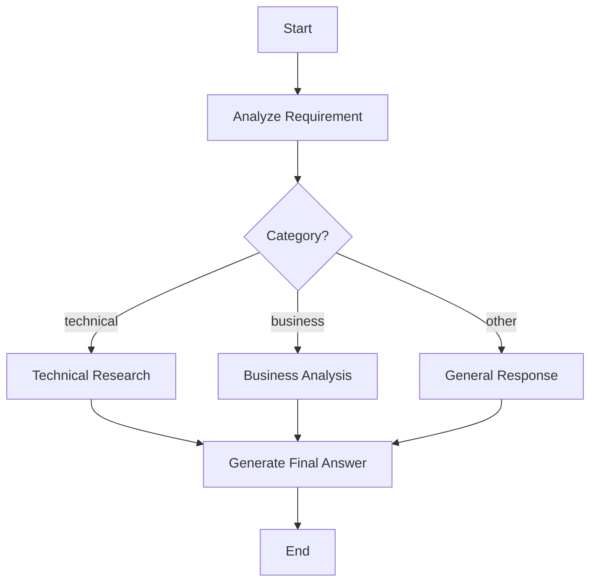

# Agent Workflow 需求设计文档

> 版本：v1.0  
> 状态：Draft  
> 目标：定义一套以“Agent 控制流图”为核心的 Workflow 产品模型，降低用户对 LLM、Tool、State、MessageHistory 等底层实现细节的感知。

---

## 1. 背景

当前常见的低代码 Agent / Workflow 产品，通常将 Prompt、LLM、Tool、Parser、Output 等都作为画布节点暴露给用户，并要求用户手工完成数据映射，例如：

```text
$state.echo_result.echo
$state.captured_input
$state.node_xxx.output
```

这种模型存在以下问题：

1. 抽象层级偏低，用户被迫理解 Agent 的内部执行过程。
2. Prompt、LLM、Tool 的连线容易演化成“模型调用编排”，而不是“业务流程编排”。
3. ToolCall / ToolResult、MessageHistory、结构化数据、附件等数据混杂在同一 State 中。
4. 用户需要了解内部 State 路径，配置复杂且容易出错。
5. Tool 调用过程被显式暴露，画布容易膨胀。
6. Workflow 复用能力不足，难以将成熟流程作为黑盒能力再次组合。
7. Condition 往往依赖字符串解析或内部路径，缺少强类型结构化约束。

因此，需要将 Workflow 的抽象层级提升为：

> **Workflow 是一个 Agent Control Flow Graph；画布上的节点只描述 Agent 在某个阶段应该遵循的目标、规则、输出格式以及控制流。**

LLM、Tool Calling、MessageHistory、输出格式校验、重试等属于 Runtime 的隐式执行机制。

---

# 2. 产品目标

## 2.1 核心目标

系统应满足以下原则：

1. Workflow 是控制流图，不是 LLM/Tool 数据流图。
2. 普通 Node 表示“一个 Agent 阶段”，而不是“一次 LLM 调用”。
3. 一个普通 Node 内部可执行多轮 `LLM -> Tool -> LLM`。
4. Tool 是 Agent Capability，不作为普通控制流节点参与连线。
5. LLM 决定是否调用 Tool；Graph 决定下一个 Node。
6. Condition 只读取结构化 NodeResult，不解析自然语言。
7. Workflow 可以引用其他 Workflow。
8. 用户不需要理解 `$state.xxx` 结构。
9. MessageHistory、NodeResult、Artifact 必须分离管理。
10. Workflow 的最终结果由 Runtime / End Node 负责收敛，而不是要求 LLM 写入某个固定 State 字段。

## 2.2 非目标

当前阶段不优先实现：

- BPMN 全量兼容。
- 任意脚本节点。
- 用户自定义底层 Runtime。
- Tool 之间复杂数据流编排。
- 低层级 Token-by-Token Agent 调试器。
- 跨租户 Workflow 共享治理。

---

# 3. 核心概念

## 3.1 Workflow

Workflow 是一个可执行 Agent 控制流图。

```text
Workflow
├── Graph
├── Agent Runtime Config
├── Tool Registry
├── Input Contract
├── Output Contract
└── Runtime State
```

Workflow 应具备：

- 唯一 ID
- 名称
- 描述
- 版本
- 输入协议
- 输出协议
- 可用 Tool 列表
- Graph
- Runtime 限制
- 发布状态

---

## 3.2 Graph Node 类型

MVP 建议仅暴露以下四类核心节点：

### 3.2.1 Agent Node

表示 Agent 在某个业务阶段应完成的任务。

核心属性：

- Goal / Instruction
- Input Context Policy
- Output Schema
- Tool Policy
- Completion Policy
- Retry Policy
- Visibility
- Transition

示例：

```text
节点：分析用户需求

Goal：
分析用户输入，判断需求类型并给出摘要。

Output Schema：
{
  category: technical | business | other,
  summary: string,
  confidence: number
}
```

Agent Node 不表示一次 LLM 调用。

一个 Node 内部允许：

```text
LLM
 ↓ ToolCall
Tool
 ↓ ToolResult
LLM
 ↓ ToolCall
Tool
 ↓ ToolResult
LLM
 ↓ Final Structured Result
Node Completed
```

---

### 3.2.2 Condition Node

Condition Node 是确定性控制流节点。

它：

- 不调用 LLM。
- 不调用 Tool。
- 读取前序 NodeResult。
- 根据字段、操作符和值决定下一节点。

示例：

```text
字段：category
操作符：equals
值：technical
```

内部可以解析为：

```text
node_results["analyze_requirement"].category == "technical"
```

但该内部表达式不向普通用户暴露。

---

### 3.2.3 Workflow Node

用于引用另一个 Workflow。

子 Workflow 对父 Workflow 表现为一个黑盒函数：

```text
Input Contract -> Sub Workflow -> Output Contract
```

示例：

```text
ResearchWorkflow
Input:
{
  topic: string
}

Output:
{
  summary: string,
  sources: Source[],
  confidence: number
}
```

父 Workflow 只关心：

- 输入字段如何绑定。
- 输出 Schema 是什么。
- 执行成功 / 失败后的转移。

父 Workflow 不感知子 Workflow 内部 Agent Loop。

---

### 3.2.4 End Node

End Node 用于定义 Workflow 的最终结果收敛规则。

End Node 不调用 LLM。

默认行为：

```text
PrimaryMessage = 最后一个 Visible Assistant Message
Artifacts      = 本次 Run 中所有 Visible Artifacts
Data           = null
```

高级模式允许配置：

- Primary Message 来源
- Artifact 来源
- Structured Data 来源

---

# 4. Agent Node 规则

## 4.1 Agent Node 的职责

Agent Node 只负责描述：

1. 当前阶段目标。
2. 当前阶段可使用哪些上下文。
3. 当前阶段可以使用哪些 Tool。
4. 当前阶段输出必须满足什么结构。
5. 当前阶段何时算完成。
6. 完成后如何进入下一个节点。

Agent Node 不负责：

- 手工构造 MessageHistory。
- 手工执行 Tool。
- 手工拼装 ToolResult。
- 手工更新内部 State。
- 直接决定整个 Workflow 是否结束。

---

## 4.2 Instruction

Instruction 表示当前 Agent 阶段的临时规则。

默认特性：

- 仅在当前 Node Execution 中生效。
- 不永久写入 MessageHistory。
- 每次 LLM 调用自动注入。

示例：

```text
请分析用户需求，并严格按照输出结构返回分类结果。
```

---

## 4.3 Output Schema

每个 Agent Node 应允许定义结构化输出 Schema。

MVP 推荐使用 JSON Schema 子集。

支持：

- string
- number
- integer
- boolean
- enum
- object
- array
- required
- description

示例：

```json
{
  "type": "object",
  "properties": {
    "category": {
      "type": "string",
      "enum": ["technical", "business", "other"]
    },
    "summary": {
      "type": "string"
    },
    "confidence": {
      "type": "number"
    }
  },
  "required": ["category", "summary"]
}
```

Node 完成前，Runtime 必须对 LLM 输出执行 Schema Validation。

---

## 4.4 Schema Retry

若 LLM 输出不符合 Schema：

```text
LLM Output
   ↓
Schema Validation Failed
   ↓
Runtime 自动生成修正提示
   ↓
LLM Retry
```

默认：

- `max_schema_retries = 2`

超过最大次数后：

- Node 标记失败。
- 进入失败转移或终止 Workflow。

---

## 4.5 Node Visibility

Node 支持：

- Hidden
- Visible
- Auto

### Hidden

中间分析结果不向聊天 UI 展示。

### Visible

Node 产生的 Assistant Message 可以向用户展示。

### Auto

由 Runtime 根据是否为最终响应、是否生成 Artifact 等决定。

---

# 5. Agent Loop

## 5.1 定义

Agent Loop 是 Agent Node 内部的隐式执行单元。

一个 Agent Node 的完整执行过程：

```text
Build Context
    ↓
Call LLM
    ↓
┌──────────── ToolCall? ────────────┐
│ yes                               │ no
↓                                   ↓
Execute Tool                   Parse Output
↓                                   ↓
Append ToolCall               Schema Validate
Append ToolResult                  ↓
↓                               Success
Call LLM Again                     ↓
└──────────────────────────── Node Completed
```

---

## 5.2 ToolCall 规则

当 LLM 输出 ToolCall：

1. Runtime 校验 Tool 是否在当前 Node AllowedTools 中。
2. 校验参数 Schema。
3. 执行 Tool。
4. 将 ToolCall 写入 MessageHistory。
5. 将 ToolResult 写入 MessageHistory。
6. 保证 ToolCall / ToolResult 成对。
7. 使用更新后的 MessageHistory 再次调用 LLM。

---

## 5.3 Agent Loop 结束条件

当前 Node Agent Loop 结束条件：

1. LLM 未返回 ToolCall。
2. LLM 返回了当前 Node 的最终结果。
3. 最终结果通过 Output Schema 校验。

Workflow 是否结束，不由 LLM 决定。

Workflow 的结束仅由 Graph / End Node 决定。

---

# 6. Tool 设计

## 6.1 Tool 不参与 Graph 连线

Tool 属于 Agent Capability。

错误模型：

```text
Agent Node -> Search Tool Node -> Agent Node
```

推荐模型：

```text
Agent Node
  ├── Search
  ├── Database
  └── File Generator
```

Tool 由 LLM 在 Agent Loop 中按需调用。

---

## 6.2 Workflow Tool Registry

Workflow 维护可用 Tool 集合：

```text
Workflow Tools
☑ Web Search
☑ HTTP
☑ Database
☑ File Generator
☐ Email
```

每个 Agent Node 可再定义 Tool Scope。

```text
AvailableTools(Node)
=
WorkflowTools ∩ NodeAllowedTools
```

---

## 6.3 Tool Policy

Agent Node 支持：

### Auto

LLM 可自行决定是否调用 Tool。

### Required

Node 必须至少调用指定 Tool 才允许完成。

示例：

```text
Required Tool = WebSearch
```

适用于“获取最新信息”等强制外部数据场景。

### Disabled

当前 Node 禁止调用任何 Tool。

---

## 6.4 ToolResult

ToolResult 必须：

- 有对应 ToolCallId。
- 包含成功 / 失败状态。
- 可包含结构化 Data。
- 可包含 ArtifactRef。
- 可包含用户可见 Message。

---

# 7. MessageHistory

## 7.1 定位

MessageHistory 是 Agent Conversation Memory，不是 Workflow 数据总线。

应包含：

- User Message
- Assistant Message
- Assistant ToolCall
- ToolResult

不应默认包含：

- Node Instruction
- Node 内部 Metadata
- Condition 中间状态
- Graph 状态
- Runtime Counter

---

## 7.2 ToolCall 配对约束

必须保证：

```text
Assistant ToolCall
        ↓
ToolResult
```

成对存在。

删除 / 编辑 / 压缩 MessageHistory 时，不允许破坏 ToolCall / ToolResult 对。

---

# 8. NodeResult

NodeResult 是每个 Node 的结构化业务输出。

建议统一格式：

```json
{
  "node_id": "analyze_requirement",
  "status": "success",
  "data": {},
  "messages": [],
  "artifacts": [],
  "metadata": {}
}
```

其中：

- `data`：用于 Condition / 下游节点引用。
- `messages`：可选对话消息。
- `artifacts`：当前 Node 创建的附件引用。
- `metadata`：Runtime 内部调试信息。

Condition 应读取 `NodeResult.data`，不读取 Assistant Message。

---

# 9. Artifact

附件不得仅存在于 MessageHistory。

Artifact 应独立存储，并通过 ArtifactRef 被 Message / NodeResult 引用。

```json
{
  "id": "artifact_001",
  "type": "file",
  "name": "report.pdf",
  "mime_type": "application/pdf",
  "uri": "/artifacts/artifact_001",
  "created_by": "generate_report"
}
```

Message 中：

```json
{
  "type": "artifact_ref",
  "artifact_id": "artifact_001"
}
```

这样即使最终 MessageHistory 最后一条没有附件，也不会导致 Artifact 丢失。

---

# 10. Condition Node

## 10.1 数据来源

Condition Node 读取某个上游 Node 的 Output Schema。

UI 根据 Schema 自动生成可选字段。

例如：

```text
Source Node: AnalyzeRequirement
Field: category
Operator: equals
Value: technical
```

---

## 10.2 操作符

MVP 支持：

### 通用

- equals
- not_equals
- exists
- not_exists

### 数值

- gt
- gte
- lt
- lte

### 字符串

- contains
- starts_with
- ends_with

### 集合

- in
- not_in
- is_empty
- is_not_empty

---

## 10.3 Default Branch

Condition 必须允许定义 Default Branch。

避免由于 Schema 扩展或未知值导致 Workflow 无路可走。

---

# 11. Transition

Graph Edge 本质上是 Transition Rule。

底层结构建议：

```text
TransitionRule
├── source_node
├── target_node
├── condition
├── priority
└── is_default
```

UI 可以保留 Condition Node 以提高可读性。

未来可以支持 Edge Condition，但 MVP 不建议同时暴露两套复杂模型。

---

# 12. Workflow 引用 Workflow

## 12.1 Contract

每个 Workflow 必须定义：

- Input Schema
- Output Schema

Workflow Node 只能通过 Contract 与子 Workflow 交互。

---

## 12.2 输入映射

普通用户不填写：

```text
$state.nodeA.output.topic
```

UI 应提供：

```text
子 Workflow 参数：topic
来源：
○ 用户输入
○ AnalyzeRequirement.topic
○ 固定值
```

---

## 12.3 消息上下文策略

子 Workflow 调用支持：

- Inherit Messages
- Isolated Messages

### Inherit Messages

继承父 Workflow MessageHistory。

适用于连续 Agent 任务。

### Isolated Messages

子 Workflow 使用独立 MessageHistory。

适用于可复用黑盒子流程。

MVP 默认推荐 `Inherit Messages`，但必须预留 Isolated 模式。

---

# 13. Input / Output Contract

## 13.1 Workflow Input

Workflow 支持：

```json
{
  "message": "用户输入",
  "data": {},
  "artifacts": []
}
```

简单聊天场景可以仅使用 `message`。

---

## 13.2 Workflow FinalResult

建议统一：

```json
{
  "status": "success",
  "message": null,
  "artifacts": [],
  "data": null,
  "metadata": {}
}
```

默认 FinalResult：

- message = 最后一个 Visible Assistant Message
- artifacts = 本次 Run 所有 Visible Artifact
- data = null

---

# 14. Runtime State

Runtime State 内部可包含：

```text
WorkflowRunState
├── Messages
├── NodeResults
├── Artifacts
├── CurrentNodeId
├── ExecutionCounters
├── WorkflowStack
└── RuntimeMetadata
```

但普通用户不直接操作该结构。

---

# 15. 上下文构建

每次 LLM 调用时由 ContextBuilder 自动构造：

```text
LLM Context
=
Persistent MessageHistory
+ Current Node Instruction
+ Current Node Output Schema
+ Relevant Node Results
+ Available Tools
+ Runtime System Rules
```

其中：

- Node Instruction 默认 Transient。
- Schema 默认 Transient。
- Runtime Rule 默认 Transient。

---

# 16. Runtime 安全限制

Agent Loop 隐式执行后必须增加硬限制。

建议系统默认值：

```text
max_llm_turns_per_node = 10
max_tool_calls_per_node = 20
max_node_executions     = 100
max_workflow_depth      = 8
max_schema_retries      = 2
```

还应支持：

- Workflow Timeout
- Tool Timeout
- LLM Timeout
- CancellationToken
- Run Cancel

---

# 17. 错误处理

错误分为：

1. LLM Error
2. Tool Error
3. Schema Validation Error
4. Condition Evaluation Error
5. Sub Workflow Error
6. Runtime Limit Error
7. Cancelled

Node 可配置：

- Retry
- Fail Workflow
- Continue To Failure Node

MVP 推荐：

```text
Success Edge
Failure Edge
```

---

# 18. 运行状态

WorkflowRun：

- Pending
- Running
- Waiting
- Succeeded
- Failed
- Cancelled

NodeExecution：

- Pending
- Running
- Succeeded
- Failed
- Skipped

---

# 19. 可观测性

虽然 Tool 和 LLM 在画布上是隐式的，但运行详情必须可查看。

调试模式需要展示：

```text
Node Execution
├── LLM Call #1
├── ToolCall #1
├── ToolResult #1
├── LLM Call #2
├── Schema Validation
└── NodeResult
```

用户应能看到执行轨迹，但不要求在 Graph 上手工连这些步骤。

---

# 20. 典型示例

## 20.1 技术问题处理 Workflow



`Technical Research` 内部可能执行：

```text
LLM
 -> WebSearch
 -> LLM
 -> KnowledgeBase
 -> LLM
 -> Final NodeResult
```

但这些均不出现在 Graph 上。

---

# 21. MVP 范围

MVP 建议实现：

- Workflow CRUD
- Agent Node
- Condition Node
- Workflow Node
- End Node
- Workflow Tool Registry
- Node Tool Policy
- Agent Loop
- ToolCall / ToolResult
- MessageHistory
- NodeResult
- ArtifactRef
- JSON Schema 输出约束
- Schema Retry
- Run / Cancel
- Execution Trace
- 子 Workflow 调用
- FinalResult

---

# 22. 验收标准

满足以下条件视为核心设计完成：

1. 用户可以在不填写 `$state.xxx` 的情况下配置完整 Workflow。
2. Agent Node 内 ToolCall 自动执行并自动回填 MessageHistory。
3. Tool 不需要出现在画布连线中。
4. Condition 可以直接基于上游 Node 的 Schema 字段配置条件。
5. LLM 输出格式错误时可自动重试修正。
6. 子 Workflow 可以按 Input / Output Contract 被引用。
7. Artifact 不依赖 MessageHistory 最后一条消息保存。
8. Graph 决定 Workflow Control Flow，LLM 无权直接跳转任意节点。
9. 运行详情中可以查看隐式 LLM / Tool 执行轨迹。
10. 简单 Workflow 不需要显式配置底层 State。

---

# 23. 设计原则总结

> 用户编排的是 Agent 的“业务行为”，而不是 Agent 的“内部实现”。

```text
用户看到：
分析需求 -> 判断类型 -> 研究 -> 生成结果

Runtime 执行：
Prompt Build -> LLM -> ToolCall -> ToolResult -> LLM -> Parse -> Validate -> Route
```

这是本 Workflow 系统最核心的抽象边界。
